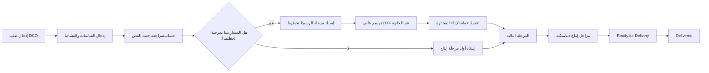

# 01 — نظرة عامة على النظام

> **Status:** Canonical  
> **Audience:** الجميع

## 1. ما هو Almdina ERP؟

Almdina ERP هو تطبيق Frappe/ERPNext لإدارة رحلة طلبات قص وتجهيز درف MDF من لحظة إدخال قياسات الزبون حتى انتهاء مراحل المعمل والتسليم، مع فصل واضح بين التخطيط، التشغيل، التكلفة الداخلية، ومستندات الزبون.

المستند المحوري هو **Door Cutting Order (DCO)**. حوله ترتبط القياسات، خطة القص، الرسم الخاص، DXF، مراحل الإنتاج، الحوادث والتعويضات، والتكلفة.

## 2. رحلة العمل المبسطة

المسار الإنتاجي **ليس hard-coded كأسماء أدوار ثابتة**. `Production Routing` يحدد المراحل وترتيبها والدور التشغيلي المطلوب لكل مرحلة.

## 3. من هم المستخدمون؟

النظام لا يفرض أسماء Roles تجارية ثابتة. يمكن للإدارة إنشاء Role ثم إعطاءه Capabilities ثم إسناده للمستخدم.

عمليًا توجد Personas مفهومية مثل:

- **مدخل البيانات:** ينشئ/يعدل الطلبات المسموح بها ويطبع مستندات الزبون حسب الصلاحية.
- **عامل الرسم/التخطيط:** يرى العمل المسند له، يراجع الخطة، يتعامل مع الرسم وDXF حسب Capability.
- **عامل CNC/القص:** يبدأ/ينهي مرحلته المسندة فقط ويقرأ المعلومات التشغيلية اللازمة.
- **عامل التقشيط/المرحلة التالية:** يرى ويعالج ما أسند له.
- **مشرف الإنتاج:** يرسل الطلب للإنتاج، يعيد الإسناد، يرجع مرحلة سابقة أو يؤكد التسليم حسب الصلاحيات.
- **مالي:** يرى التكلفة/التقارير المالية دون أن يصبح عامل إنتاج تلقائيًا.
- **مسؤول الصلاحيات:** يدير Roles/Capabilities دون أن يحصل تلقائيًا على صلاحيات التشغيل أو التكلفة.
- **Administrator:** Superuser تقني صريح.

## 4. النطاق النشط

المصدر الملزم هو `docs/PRODUCT_SCOPE_v1.1.md`.

### Included

- Board description نصي + الأبعاد.
- Door pieces وكمية كل قطعة.
- القشاط لكل ضلع وحسميات السماكة.
- Regular / clipped-corner / special pieces.
- Cutting optimization.
- Cutting Plan system/custom/approved behavior.
- Drawing workspace وDXF.
- Production Routing وProduction Stages.
- Incidents وReplacement Pieces.
- Operational cost + customer quote/invoice + printing.
- صلاحيات دقيقة وتقارير تشغيلية ومالية.

### Explicitly excluded from new product code

- Stock Items كهوية إجبارية للوح.
- Warehouses/Stock balances.
- Reservations/Consumption/Stock Entry.
- Board Remnant inventory/reuse.
- Material variance accounting المرتبط بالمخزون.

قد ترى ملفاتًا أو DocTypes تاريخية لهذه الميزات؛ لا تعتبرها متطلبًا حاليًا ولا تربط Feature جديدة بها.

## 5. مبادئ تجربة الاستخدام

- **نفس الواجهة، بيانات مختلفة حسب المستخدم** قدر الإمكان؛ لا نبني نسخة واجهة منفصلة لكل عامل إلا لسبب وظيفي.
- العامل يرى العمل المسند له، والعمل المنتهي ينتقل إلى تاريخه/Archive حسب العقد الحالي.
- الصلاحية لا تُفهم من إخفاء زر فقط؛ Server authorization هو الحكم النهائي.
- البيانات المالية لا تظهر لمجرد أن المستخدم يستطيع فتح الطلب.
- مسارات الإدخال اليومية يجب أن تبقى سريعة ومناسبة للمستخدم غير المصمم.

## 6. ما الذي لا ينبغي أن يقرره الـUI؟

الـUI يعرض ويجمع مدخلات المستخدم، لكنه لا يجب أن يقرر وحده:

- هل المستخدم مخول؟
- هل المرحلة الحالية تسمح بالفعل؟
- ما تكلفة الطلب؟
- ما أبعاد القص النهائية بعد القشاط؟
- هل DXF صالح هندسيًا؟
- هل الخطة قابلة للاعتماد؟

هذه قرارات Domain/Application/Server.

## 7. أهم مصطلح لفهم المشروع

**Role ≠ Permission ≠ Operational Role ≠ Assignment.**

- Role: مجموعة تُعطى للمستخدم.
- Capability: سلطة عمل محددة.
- Operational Role: الدور المطلوب لمرحلة داخل Production Route.
- Assignment: المستخدم المحدد الذي يملك تنفيذ المرحلة الحالية.

راجع [Security & Permissions](04_SECURITY_PERMISSIONS.md) للتفصيل.