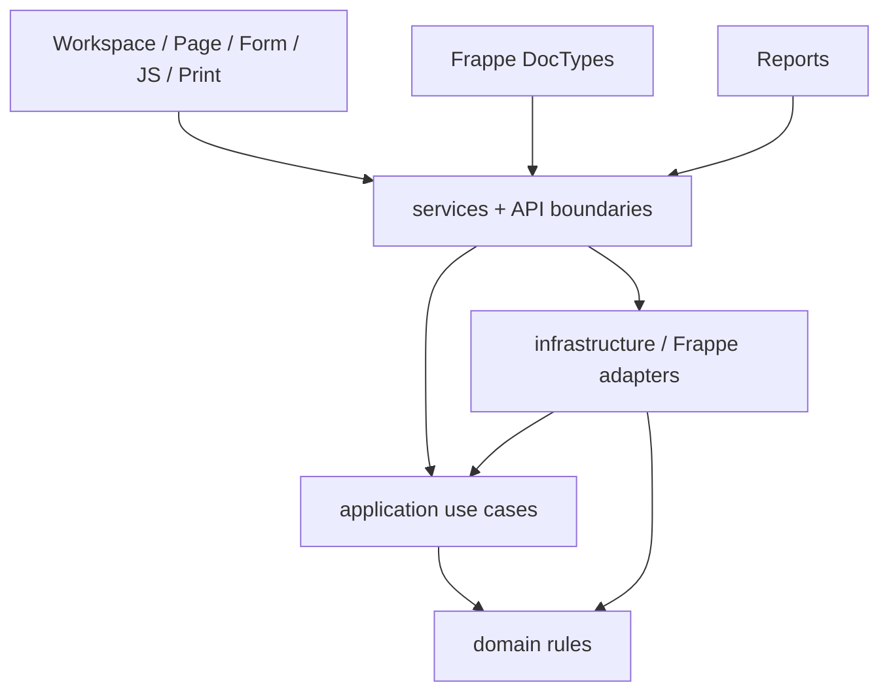

# 02 — المعمارية البرمجية

> **Status:** Canonical / Frozen boundary  
> **Audience:** Developers, reviewers, Coding AI

## 1. الهدف المعماري

المشروع يعتمد **Clean Architecture عملية داخل Frappe**: قواعد المصنع يجب أن تبقى قابلة للفهم والاختبار دون تشغيل Frappe، بينما Frappe يبقى Framework للتخزين، الجلسة، DocTypes، UI والـRPC.

الأسهم المهمة هي اتجاه الاعتماد: **القلب لا يعرف الطبقات الخارجية**.

## 2. الطبقات ومسؤوليتها

### `domain/`

يمثل قواعد العمل الخالصة:

- Cutting geometry/optimizer primitives and strategies.
- Order costing and cut dimensions.
- Lifecycle/state decisions.
- Production routing and production authorization facts.
- Replacement planning/authorization.
- Capability catalog.

**ممنوع:** `frappe`, `services`, `infrastructure`, `doctype`, `page`, `report`, `presentation`.

### `application/`

ينسق Use Cases ويعتمد على Protocols/Ports:

- Optimize order plan.
- Process order save.
- Plan snapshot sanitization.
- Shop-floor commands/queries.
- Permission context/matrix behavior.
- Production routing management.
- Financial document construction.

**ممنوع:** استيراد Frappe أو Adapters الخارجية. Stage 13 يختبر هذا آليًا.

### `infrastructure/`

طبقة الربط مع العالم الخارجي، وبالأخص Frappe:

- repositories.
- document access.
- authorization gateway.
- permission persistence/projection.
- Frappe adapters for costing/plan/piece policy.
- DXF file reading adapter.
- stage/routing repositories.

هذه الطبقة تعرف Frappe وتطبق Ports التي تحتاجها Application.

### `services/`

حدود RPC/واجهة التطبيق والتوافق:

- whitelisted endpoints.
- استدعاء Authorization.
- تحويل مدخلات Frappe إلى Use Cases.
- Wiring بين Application وInfrastructure.
- Compatibility facades محددة فقط.

Service جيد يكون Thin: لا يعيد كتابة Formula موجودة في Domain، ولا يبني Authorization منفصلًا باسم Role.

### `doctype/`, `page/`, `report/`, `presentation/`, `workspace/`, `print_format/`

Framework/UI adapters. دورها عرض البيانات، استقبال التفاعل وربط المستخدم بخدمات التطبيق. لا يجب أن تصبح مكانًا ثانيًا لقواعد التكلفة أو lifecycle أو security.

## 3. مصفوفة الاعتماد

| الطبقة | يمكن أن تعتمد على | لا تعتمد على |
|---|---|---|
| Domain | stdlib + domain | Frappe وكل الطبقات الخارجية |
| Application | domain + application contracts | Frappe, services, infrastructure, UI layers |
| Infrastructure | domain + application + Frappe | UI business decisions |
| Services/API | application + domain + infrastructure + Frappe boundary | duplicated business rules |
| UI/Frappe metadata | services/API/view models | business authority مستقلة |

## 4. مثال: بدء مرحلة إنتاج

1. JS يرسل `stage_name`.
2. Whitelisted service لا يثق بالاسم وحده.
3. Application command يقرأ Stage/Order عبر repository.
4. Authorization يجمع Capability + current stage + operational role + assignment + lifecycle.
5. Domain يقرر إن كان الانتقال من `Pending` إلى `In Progress` صالحًا.
6. Infrastructure يحفظ التغيير ويسجل الحدث.
7. Query layer يعيد Inbox جديد للمستخدم.

لا يجب أن يكون هناك `if role == "CNC"` داخل JS أو service كبديل لهذه السلسلة.

## 5. مثال: Preview/Cost

- Preview التشغيلي لا يضمن حق رؤية التكلفة.
- `VIEW_COSTS` يقرر الحقول المالية.
- Plan snapshots التشغيلية تُنظف من بيانات التكلفة غير المسموحة.
- Customer document وInternal cost report مساران منفصلان.

## 6. Compatibility boundaries المتعمدة

Stage 11 أبقى عددًا محدودًا من الحدود التاريخية لأسباب توافق، وليس لتطوير Features جديدة:

1. Thin DCO base الذي يحتاجه Frappe.
2. Cutting Plan compatibility facade.
3. Production compatibility facade.
4. Order Creation tombstone بلا Business Logic.

قاعدة: **لا توسّع facade قديمة لتسهيل Feature جديدة**. ابدأ من Domain/Application الصحيح ثم اربط facade فقط إذا كان هناك Caller قديم يجب الحفاظ عليه.

## 7. Historical inventory code

وجود `domain/inventory`, `application/inventory`, `infrastructure/frappe/inventory`, `Board Remnant` أو صفحات stock لا يعني أنها ضمن Active Scope. `PRODUCT_SCOPE_v1.1.md` هو الحكم، ويمنع active modules الجديدة من ربط order approval/customer costing بتلك الخدمات.

## 8. قواعد معمارية محمية آليًا

Stage 13 يثبت على الأقل:

- Domain Framework-free ويتجه للداخل فقط.
- Application Framework-free ولا يعتمد على adapters.
- لا Role-name authorization ثابت في المسار النشط.
- لا `frappe.db.sql`, `frappe.get_doc`, `frappe.new_doc` داخل Architecture core.
- بوابة الجودة نفسها لا تستخدم `continue-on-error` أو `|| true` لتجاوز الفشل.

## 9. أين أبدأ عند Feature جديدة؟

اسأل بالترتيب:

1. هل هي ضمن Product Scope؟
2. ما Business rule الخالص؟ ضعه/اختبره في Domain.
3. ما Use Case؟ ضعه في Application.
4. ما البيانات الخارجية المطلوبة؟ عرّف Port ثم Adapter في Infrastructure.
5. ما Endpoint/UI المطلوب؟ اربطه في Service/Page بعد ذلك.
6. ما Capability/Document scope المطلوب؟ لا تؤجله لما بعد بناء الـUI.

راجع [Change Rules](07_CHANGE_RULES.md) قبل أي تنفيذ.