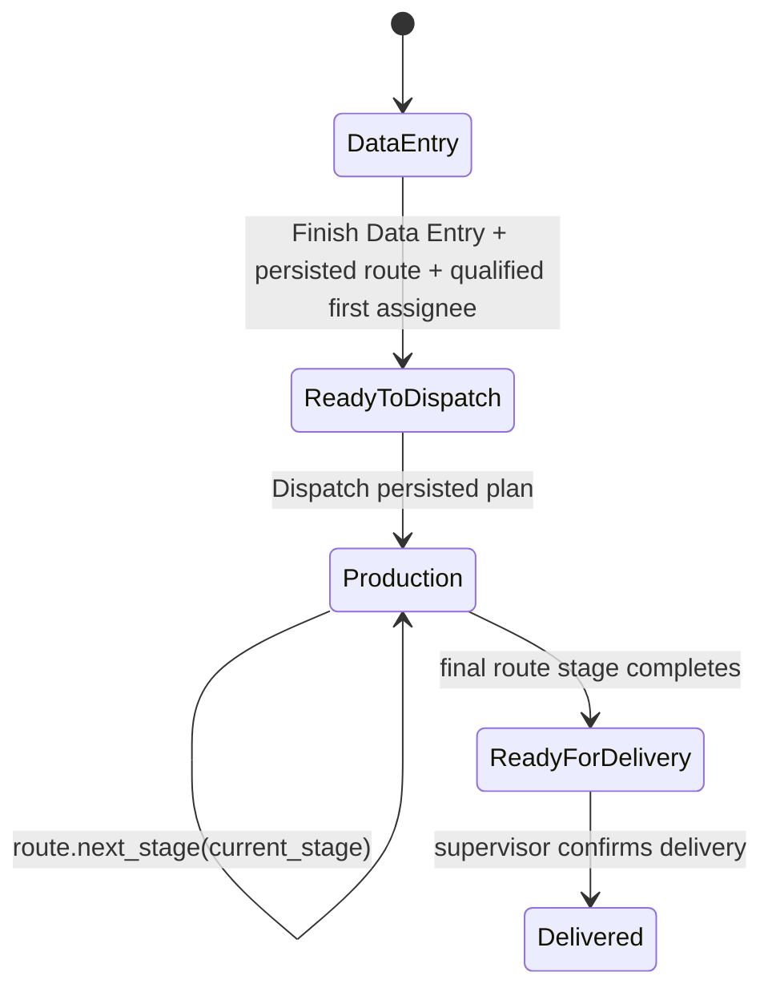

# 03 — دورة الطلب والإنتاج

> **Status:** Canonical  
> **Audience:** التشغيل، QA، developers

## 1. الفكرة الأساسية

الطلب لا يتحرك لأن اسم Role تغيّر، بل لأن **حالة الطلب + Production Route + Current Stage + Capability + Assignment** تسمح بالانتقال.

## 2. المسار التشغيلي الحالي

قبل بدء الإنتاج يمر الطلب بمرحلتين route-independent محفوظتين على `workflow_stage`:

- `DATA_ENTRY`: الطلب محفوظ على الخادم وما زال تحت مسؤولية مدخل البيانات.
- `READY_TO_DISPATCH`: اكتمل إدخال البيانات وحُفظت **خطة إرسال معلقة**، لكن الإنتاج لم يبدأ بعد.
- أثناء الحالتين يبقى `production_path` فارغًا ولا يوجد `current_production_stage`.
- `current_assignee` يبقى مدخل البيانات الحالي أثناء intake؛ العامل المختار لأول مرحلة يُحفظ منفصلًا في `planned_first_assignee` ولا يصبح assignee إنتاجيًا قبل dispatch الحقيقي.
- `planned_production_route` يحفظ المسار المختار فقط؛ لا ينشئ `Production Stage` ولا يفعّل route.
- عند dispatch الحقيقي فقط يُمسح `workflow_stage`; بعد ذلك تصبح `production_path` و`current_production_stage` و`current_department` و`current_assignee` هي الحقيقة التشغيلية للإنتاج.
- لا تُكتب مراحل Production Routing الفيزيائية داخل `workflow_stage`، ولا توجد حالة عامة من نوع `At Drawing` أو `At CNC`; الحالة العامة أثناء الإنتاج تبقى العقد العام الحالي مثل `Production In Progress`.

عند أول حفظ ناجح لطلب جديد يُهيأ `DATA_ENTRY` على الخادم. وعند ترقية موقع موجود، migration يعيد نفس التهيئة idempotently للطلبات القديمة التي لا تملك `workflow_stage` **ولم تدخل الإنتاج أصلًا**؛ تشغيل migrate مرة ثانية لا يعيد تهيئتها ولا يعيد فتح طلب دخل production.

الأسماء الفعلية لمراحل الإنتاج بعد dispatch قابلة للضبط عبر `Production Routing` و`Production Workflow Stage`. لا يعتمد runtime على أسماء Drawing/CNC/Sanding ثابتة.

## 3. Draft وReview/Approve القديم

المسار الإجباري القديم `Draft -> Pending Review -> Approved` **لم يعد شرطًا إلزاميًا لإرسال الطلب إلى الإنتاج**.

الكود يقبل dispatch من حالات توافقية مثل `Draft`, `Rejected`, `Pending Review`, `Approved`، لكن التعليق الرسمي في Domain يوضح أن Review/Approve القديم Retired كشرط Workflow.

قد تبقى endpoints وصفحات Approval للتوافق أو تاريخ المنتج. لا تبنِ Feature جديدة على فرض أن `Approved` يجب أن يسبق dispatch ما لم يصدر Product Decision جديد.

**مهم:** هذا مختلف عن **اعتماد Cutting Plan**. إذا بدأ Production Route بمرحلة تخطيط، يجب اعتماد الخطة المختارة قبل handoff من مرحلة التخطيط إلى المرحلة التالية.

## 4. إنهاء إدخال البيانات وخطة الإرسال

زر `إنهاء إدخال البيانات` هو transition من `DATA_ENTRY` إلى `READY_TO_DISPATCH`، وليس dispatch.

يلزم قبل حفظ الخطة:

- أن يكون الطلب محفوظًا ولا توجد تعديلات محلية غير محفوظة؛ الواجهة تمنع الإجراء بدل إعادة تحميل نسخة الخادم فوق عمل المستخدم.
- أن يملك المستخدم `edit_order` ضمن document scope.
- أن يبقى الطلب قبل الإنتاج: لا `production_path` ولا `current_production_stage`.
- أن يكون المستخدم هو `current_assignee` الخاص بمرحلة الإدخال، أو `Administrator`.
- اختيار `Production Routing` مفعّل.
- اختيار مستخدم مؤهل لـ`operational_role` الخاص بأول Stage في المسار.

الحفظ يكتب `READY_TO_DISPATCH` و`planned_production_route` و`planned_first_assignee` وبيانات خطة الإرسال، ولا ينشئ `Production Stage` ولا يبدأ الإنتاج ولا يغيّر `current_assignee` إلى العامل المخطط.

إذا كان الطلب أصلًا `READY_TO_DISPATCH` يستطيع مالك intake تعديل الخطة بنفس الحدود قبل بدء production. يمكن تعديل route/worker عدة مرات دون إنشاء Stage إنتاجية.

كل async completion في هذا الحوار تتبع Document identity/generation عبر `AlmdinaDocumentContext`; مغادرة الطلب أو الانتقال إلى Form آخر تمنع dialog/alert/reload قديم من الظهور في السياق الجديد.

## 5. Dispatch الحقيقي — ALMADINA-163

`إرسال للإنتاج` هو **الحد الوحيد** الذي يحول خطة `READY_TO_DISPATCH` المحفوظة إلى إنتاج فعلي.

### 5.1 عقد API

العميل يرسل هوية الطلب فقط. لا يختار route أو worker أثناء dispatch الحقيقي.

الخادم يقرأ من الطلب المقفول:

- `planned_production_route`
- `planned_first_assignee`

ولا يثق بقيم `path`, `assignee`, `stage`, أو `department` القادمة من المتصفح.

### 5.2 Transaction / Locking

الـApplication command:

1. يقفل `Door Cutting Order` باستخدام `SELECT ... FOR UPDATE`.
2. يعيد قراءة الحالة بعد الحصول على القفل.
3. يشترط `workflow_stage == READY_TO_DISPATCH` وعدم وجود production فعلي سابق.
4. يطبق `DISPATCH_ORDER` capability وdocument scope وملكية intake الحالية.
5. يعيد تحميل `planned_production_route` ويتأكد أنه ما زال مفعّلًا وصالحًا.
6. يحل `route.first_stage` ديناميكيًا.
7. يعيد التحقق من أهلية `planned_first_assignee` لـ`first_stage.operational_role`.
8. يعيد استخدام Production Authorization الحالية لتمييز Planning-first عن Physical-first وتطبيق Cutting Plan readiness الصحيحة.
9. يحافظ على Special Shape gate الحالية.
10. يفشل مغلقًا إذا وجد Production Stage route-level نشطة تتعارض مع حالة `READY_TO_DISPATCH`; لا يلغي history ولا يستخدم `cancel_active_order_stages()` لتجاوز التعارض.
11. ينشئ أول `Production Stage` مرة واحدة.
12. في نفس transaction يكتب `production_path`, `current_production_stage`, `current_department`, `current_assignee`, `department_status`, والحالة العامة، ويمسح `workflow_stage` فقط.
13. يسجل Production Event واضحًا لحد بدء الإنتاج.

لا يوجد `frappe.db.commit()` داخل use case؛ transaction الخاصة بطلب Frappe تضمن أن stage + tracking + event إما تنجح كلها أو تتراجع كلها عند exception.

### 5.3 Concurrency / Retry

طلبان متزامنان على نفس DCO يستخدمان نفس row lock. الأول ينفذ ويغيّر الحالة. الثاني ينتظر ثم يعيد القراءة بعد القفل ويرى أن `READY_TO_DISPATCH` انتهت/production بدأ، لذلك لا يستطيع إنشاء First Stage ثانية.

تعطيل الزر في JavaScript هو UX فقط؛ correctness تأتي من lock + post-lock state validation على السيرفر.

### 5.4 State ownership بعد النجاح

بعد dispatch ناجح:

- `workflow_stage = NULL`
- `production_path = planned_production_route`
- `current_production_stage = first created Production Stage`
- `current_department = route.first_stage.department_label`
- `current_assignee = planned_first_assignee`
- الحالة العامة = production status الحالية مثل `Production In Progress`

تبقى حقول الخطة المعلقة (`planned_production_route`, `planned_first_assignee`, `dispatch_planned_at`, `dispatch_planned_by`) كتاريخ للخطة التي تم إرسالها، ما لم يصدر عقد صريح آخر.

## 6. تنفيذ المرحلة

### Start

العامل يحتاج:

- `START_ASSIGNED_STAGE`.
- المرحلة هي Current Stage للطلب.
- المرحلة مسندة لنفس المستخدم.
- Stage status يسمح بـStart، عادة `Pending`.

`operational_role` يؤهل المستخدم للاستلام عند إنشاء/إعادة إسناد Stage، لكنه ليس مصدر Authorization لإجراءات production.

### Handoff / Finish

العامل يحتاج `HANDOFF_ASSIGNED_STAGE` ونفس شروط ownership. المسار الطبيعي للإنهاء يبقى من `In Progress` أو `Paused` إلى `Completed`.

يوجد استثناء مقصود للمرحلة `Pending`: إذا كانت المرحلة هي Current Stage ومسندة لنفس العامل، وكان العامل يملك `HANDOFF_ASSIGNED_STAGE` **ولا يملك** `START_ASSIGNED_STAGE`، يمكنه تنفيذ Handoff يدوي مباشر من `Pending` إلى `Completed` دون إنشاء Start وهمي. هذا لا يحدث تلقائيًا.

إذا كان العامل يملك الصلاحيتين `START_ASSIGNED_STAGE` و`HANDOFF_ASSIGNED_STAGE` معًا، فلا يجوز له تجاوز Start: في `Pending` يظهر/يُسمح Start أولًا، وبعد دخول المرحلة في حالة `In Progress` يصبح Handoff متاحًا.

إذا كانت المرحلة Planning Stage، تبقى Gate الإضافية كما هي: Production plan يجب أن يكون Approved وحديثًا حتى عند استخدام Handoff المباشر.

### Next stage

Application يقرأ المرحلة التالية حصريًا من `route.next_stage(current_stage)`. يتم إنشاء المرحلة التالية وإسنادها للعامل المناسب دون topology ثابت.

### Last stage

انتهاء آخر مرحلة يحوّل الطلب إلى `Ready for Delivery`، ثم `MARK_DELIVERED` يحوله إلى `Delivered`.

## 7. Inbox وArchive

العامل المخطط في `planned_first_assignee` لا يرى الطلب كعمل production نشط قبل dispatch الحقيقي. بعد إنشاء أول Production Stage وإسنادها له، تظهر طبيعيًا في Inbox من خلال query الحالية دون آلية Inbox خاصة بـALMADINA-163.

بعد اكتمال مرحلة عامل تنتقل مرحلته إلى Archive/التاريخ الشخصي، بينما يرى العامل التالي مرحلته الجديدة.

هذه ليست مجرد طريقة عرض؛ Stage 14 يختبر انتقال نفس الطلب بين commands وqueries معًا.

## 8. Supervisor actions

حسب Capabilities يمكن للمشرف:

- Dispatch order.
- Reassign worker لمرحلة نشطة.
- Revert إلى قسم/مرحلة سابقة مع شروط بنيوية.
- Return order to Draft.
- Mark Delivered.

Supervisor capability لا تلغي كل قواعد البنية تلقائيًا؛ بعض الإجراءات ما زالت تتطلب وجود target stage صالح أو status مناسب.

## 9. Drawing / planning handoff

إذا كان أول Stage `is_planning_stage=True`:

1. dispatch يستطيع تسليم الطلب لمرحلة التخطيط قبل وجود Cutting Plan؛ إنشاء/مراجعة الخطة هو عمل مرحلة التخطيط.
2. إذا كان العامل يملك `START_ASSIGNED_STAGE` يبدأ المرحلة؛ أما Handoff-only فيخضع لاستثناء `Pending` الموثق أعلاه.
3. يراجع System plan أو Uploaded/Custom plan حسب الصلاحيات.
4. يعالج Special Drawing/DXF إن كان مطلوبًا.
5. يعتمد Production Cutting Plan المختارة.
6. عند handoff فقط ينتقل الطلب للمرحلة التالية، مع بقاء Planning Handoff Gate إلزامية.

إذا كان أول Stage Physical، يطبق dispatch Production Authorization الحالية التي تشترط Cutting Plan صالحًا وغير stale قبل بدء المسار.

## 10. Revision

Revision تحافظ على تاريخ الطلب بدل تعديل حقيقة إنتاجية قديمة بصمت. أي تغيير يؤثر على geometry أو plan بعد نقطة اعتماد/إنتاج يجب أن يمر بالآلية المناسبة ويعيد حساب/اعتماد الخطة عند الحاجة.

لا تجعل Preview لطلب مقفل يعيد تشغيل optimizer وكأنه Draft؛ تاريخ الطلب يجب أن يبقى ثابتًا.

## 11. Incidents & Replacements

عند تلف/خطأ قطعة:

- يسجل `Production Incident` عند امتلاك Capability المناسبة.
- يمكن إنشاء `Replacement Piece` مرتبطة بالطلب/القطعة الأصلية.
- التعويض له Authorization وPlanning/Execution مستقلان.
- معرفة اسم Replacement أو DCO لا تكفي للوصول إليه؛ document scope يجب أن يثبت العلاقة.

## 12. State ownership

- Intake lifecycle rules: `domain/orders/intake_lifecycle.py`.
- Intake planning use cases: `application/orders/intake_planning.py`.
- Planned production-start use case: `application/shop_floor/planned_dispatch.py`.
- Route model: `domain/orders/production_routing.py`.
- Production authorization facts: `domain/orders/production_authorization.py`.
- Existing production commands/handoff: `application/shop_floor/commands.py`.
- Queries/Inbox/Archive: `application/shop_floor/queries.py`.
- DCO async form identity/generation: `AlmdinaDocumentContext` وفق [15 — Frontend Lifecycle](15_FRONTEND_LIFECYCLE_STANDARD.md).

هذه الملفات هي أول مكان يقرأه المطور عند تعديل Workflow.
