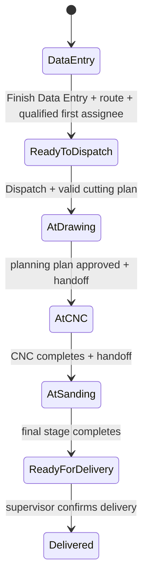

# 03 — دورة الطلب والإنتاج

> **Status:** Canonical  
> **Audience:** التشغيل، QA، developers

## 1. الفكرة الأساسية

الطلب لا يتحرك لأن اسم Role تغيّر، بل لأن **حالة الطلب + Production Route + Current Stage + Capability + Assignment** تسمح بالانتقال.

## 2. المسار التشغيلي الحالي

قبل بدء الإنتاج يمر الطلب بمرحلتين route-independent محفوظتين على `workflow_stage`:

- `DATA_ENTRY`: الطلب محفوظ على الخادم وما زال تحت مسؤولية مدخل البيانات.
- `READY_TO_DISPATCH`: اكتمل إدخال البيانات وحُفظت **خطة إرسال معلقة**، لكن الإنتاج لم يبدأ بعد.
- أثناء الحالتين يبقى `production_path` فارغًا ولا يوجد `current_production_stage`.
- `current_assignee` يبقى مدخل البيانات الحالي أثناء intake؛ العامل المختار لأول مرحلة يُحفظ منفصلًا في `planned_first_assignee` ولا يصبح assignee إنتاجيًا قبل dispatch الحقيقي.
- `planned_production_route` يحفظ المسار المختار فقط؛ لا ينشئ `Production Stage` ولا يفعّل route.

عند أول حفظ ناجح لطلب جديد يُهيأ `DATA_ENTRY` على الخادم. وعند ترقية موقع موجود، migration يعيد نفس التهيئة idempotently للطلبات القديمة التي لا تملك `workflow_stage` **ولم تدخل الإنتاج أصلًا**؛ تشغيل migrate مرة ثانية لا يعيد تهيئتها ولا يعيد فتح طلب دخل production.

الأسماء الفعلية لمراحل الإنتاج بعد dispatch قابلة للضبط عبر `Production Routing`. المثال أعلاه يمثل Route يبدأ بمرحلة تخطيط Drawing ثم CNC ثم Sanding/تقشيط.

## 3. Draft وReview/Approve القديم

المسار الإجباري القديم `Draft -> Pending Review -> Approved` **لم يعد شرطًا إلزاميًا لإرسال الطلب إلى الإنتاج**.

الكود يقبل dispatch من حالات توافقية مثل `Draft`, `Rejected`, `Pending Review`, `Approved`، لكن التعليق الرسمي في Domain يوضح أن Review/Approve القديم Retired كشرط Workflow.

قد تبقى endpoints وصفحات Approval للتوافق أو تاريخ المنتج. لا تبنِ Feature جديدة على فرض أن `Approved` يجب أن يسبق dispatch ما لم يصدر Product Decision جديد.

**مهم:** هذا مختلف عن **اعتماد Cutting Plan**. إذا بدأ Production Route بمرحلة تخطيط، يجب اعتماد الخطة المختارة قبل handoff من مرحلة التخطيط إلى المرحلة التالية.

## 4. إنهاء إدخال البيانات وخطة الإرسال

زر `إنهاء إدخال البيانات` هو transition من `DATA_ENTRY` إلى `READY_TO_DISPATCH`، وليس dispatch.

يلزم قبل حفظ الخطة:

- أن يكون الطلب محفوظًا ولا توجد تعديلات محلية غير محفوظة؛ الواجهة تمنع الإجراء بدل إعادة تحميل نسخة الخادم فوق عمل المستخدم.
- أن يملك المستخدم `edit_order` ضمن document scope.
- أن يبقى الطلب قبل الإنتاج: لا `production_path` ولا `current_production_stage`.
- أن يكون المستخدم هو `current_assignee` الخاص بمرحلة الإدخال، أو `Administrator`.
- اختيار `Production Routing` مفعّل.
- اختيار مستخدم مؤهل لـ`operational_role` الخاص بأول Stage في المسار.

الحفظ يكتب `READY_TO_DISPATCH` و`planned_production_route` و`planned_first_assignee` وبيانات من خطط الإرسال، ولا ينشئ `Production Stage` ولا يبدأ الإنتاج ولا يغيّر `current_assignee` إلى العامل المخطط.

إذا كان الطلب أصلًا `READY_TO_DISPATCH` يستطيع مالك intake تعديل الخطة بنفس الحدود قبل بدء production.

كل async completion في هذا الحوار تتبع Document identity/generation عبر `AlmdinaDocumentContext`; مغادرة الطلب أو الانتقال إلى Form آخر تمنع dialog/alert/reload قديم من الظهور في السياق الجديد.

## 5. Dispatch

Dispatch الحقيقي هو الحد الذي يبدأ عنده production. خطة `READY_TO_DISPATCH` المعلقة لا تعني أن هذا الحد عُبر.

لإرسال الطلب للإنتاج يلزم، كحد أدنى وفق عقد dispatch:

- `DISPATCH_ORDER` capability.
- حالة قابلة للإرسال.
- الطلب غير dispatched مسبقًا.
- وجود Cutting Plan صالح.
- ألا تكون الخطة بحاجة لإعادة حساب.
- Route صالح.
- العامل المختار يملك `operational_role` المطلوب لأول مرحلة.

بعد dispatch فقط ينشأ Current Production Stage ويُسند لمستخدم محدد. تغيير سلوك dispatch الفعلي أو زر بدء الإنتاج ليس جزءًا من عقد intake نفسه.

## 6. تنفيذ المرحلة

### Start

العامل يحتاج:

- `START_ASSIGNED_STAGE`.
- المرحلة هي Current Stage للطلب.
- Role المستخدم يطابق `operational_role` للمرحلة أو Administrator.
- المرحلة مسندة لنفس المستخدم.
- Stage status يسمح بـStart، عادة `Pending`.

### Handoff / Finish

العامل يحتاج `HANDOFF_ASSIGNED_STAGE` ونفس شروط ownership. المسار الطبيعي للإنهاء يبقى من `In Progress` أو `Paused` إلى `Completed`.

يوجد استثناء مقصود للمرحلة `Pending`: إذا كانت المرحلة هي Current Stage ومسندة لنفس العامل، وكان العامل يملك `HANDOFF_ASSIGNED_STAGE` **ولا يملك** `START_ASSIGNED_STAGE`، يمكنه تنفيذ Handoff يدوي مباشر من `Pending` إلى `Completed` دون إنشاء Start وهمي. هذا لا يحدث تلقائيًا.

إذا كان العامل يملك الصلاحيتين `START_ASSIGNED_STAGE` و`HANDOFF_ASSIGNED_STAGE` معًا، فلا يجوز له تجاوز Start: في `Pending` يظهر/يُسمح Start أولًا، وبعد دخول المرحلة في حالة `In Progress` يصبح Handoff متاحًا.

إذا كانت المرحلة Planning Stage، تبقى Gate الإضافية كما هي: Production plan يجب أن يكون Approved وحديثًا حتى عند استخدام Handoff المباشر.

### Next stage

Application يقرأ المرحلة التالية من Route، لا من سلسلة `if` ثابتة. يتم إنشاء/تفعيل المرحلة التالية وإسنادها للعامل المناسب.

### Last stage

انتهاء آخر مرحلة يحوّل الطلب إلى `Ready for Delivery`، ثم `MARK_DELIVERED` يحوله إلى `Delivered`.

## 7. Inbox وArchive

العامل يرى العمل النشط المسند له في Inbox. بعد اكتمال مرحلته ينتقل سجله إلى Archive/التاريخ الشخصي، بينما يرى العامل التالي مرحلته الجديدة.

هذه ليست مجرد طريقة عرض؛ Stage 14 يختبر انتقال نفس الطلب بين commands وqueries معًا.

## 8. Supervisor actions

حسب Capabilities يمكن للمشرف:

- Dispatch order.
- Reassign worker لمرحلة نشطة.
- Revert إلى قسم/مرحلة سابقة مع شروط بنيوية.
- Return order to Draft.
- Mark Delivered.

Supervisor capability لا تلغي كل قواعد البنية تلقائيًا؛ بعض الإجراءات ما زالت تتطلب وجود target stage صالح أو status مناسب.

## 9. Drawing / planning handoff

إذا كان أول Stage `is_planning_stage=True`:

1. إذا كان العامل يملك `START_ASSIGNED_STAGE` يبدأ المرحلة؛ أما Handoff-only فيخضع لاستثناء `Pending` الموثق أعلاه.
2. يراجع System plan أو Uploaded/Custom plan حسب الصلاحيات.
3. يعالج Special Drawing/DXF إن كان مطلوبًا.
4. يعتمد Production Cutting Plan المختارة.
5. عند handoff فقط ينتقل الطلب للمرحلة التالية، مع بقاء Planning Handoff Gate إلزامية في الحالتين.

## 10. Revision

Revision تحافظ على تاريخ الطلب بدل تعديل حقيقة إنتاجية قديمة بصمت. أي تغيير يؤثر على geometry أو plan بعد نقطة اعتماد/إنتاج يجب أن يمر بالآلية المناسبة ويعيد حساب/اعتماد الخطة عند الحاجة.

لا تجعل Preview لطلب مقفل يعيد تشغيل optimizer وكأنه Draft؛ تاريخ الطلب يجب أن يبقى ثابتًا.

## 11. Incidents & Replacements

عند تلف/خطأ قطعة:

- يسجل `Production Incident` عند امتلاك Capability المناسبة.
- يمكن إنشاء `Replacement Piece` مرتبطة بالطلب/القطعة الأصلية.
- التعويض له Authorization وPlanning/Execution مستقلان.
- معرفة اسم Replacement أو DCO لا تكفي للوصول إليه؛ document scope يجب أن يثبت العلاقة.

## 12. State ownership

- Intake lifecycle rules: `domain/orders/intake_lifecycle.py`.
- Intake use cases: `application/orders/intake_planning.py`.
- Route model: `domain/orders/production_routing.py`.
- Production authorization facts: `domain/orders/production_authorization.py`.
- Commands: `application/shop_floor/commands.py`.
- Queries/Inbox/Archive: `application/shop_floor/queries.py`.
- DCO async form identity/generation: `AlmdinaDocumentContext` وفق [15 — Frontend Lifecycle](15_FRONTEND_LIFECYCLE_STANDARD.md).

هذه الملفات هي أول مكان يقرأه المطور عند تعديل Workflow.
