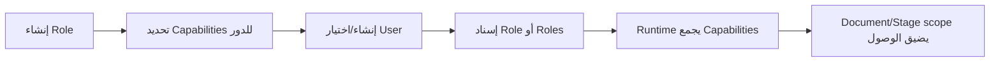

# 04 — الصلاحيات والأمان

> **Status:** Canonical / Security-critical  
> **Audience:** مسؤولو النظام، developers, QA

## 1. النموذج الأمني في جملة واحدة

```text
Allowed action
= Business Capability
+ Document visibility/scope
+ Lifecycle state
+ Production stage operational role (عند الحاجة)
+ Current assignment (عند الحاجة)
+ Action-specific structural rules
```

إخفاء زر في الواجهة ليس Authorization.

## 2. Role وCapability ليسا الشيء نفسه

### Frappe Role

اسم/مجموعة تُسند للمستخدم. يمكن إنشاء Roles جديدة من الواجهة.

### Business Capability

مفتاح ثابت يعبّر عن فعل محدد مثل `edit_order`, `upload_dxf`, `view_costs`, `dispatch_order`.

الـRole يحصل على مجموعة Capabilities. لذلك لا نكتب كودًا جديدًا يقول: “إذا كان اسم الدور Cutting Operator فاسمح”.

### Operational Role

كل Stage في `Production Routing` يحمل `operational_role`. هذا يحدد نوع العامل المقبول للمرحلة.

### Assignment

حتى لو كان المستخدم يحمل الدور التشغيلي الصحيح، يجب في أفعال العامل اليومية أن تكون **المرحلة مسندة إليه** عندما يتطلب العقد ذلك.

## 3. Administrator وSystem Manager

- `Administrator`: Superuser صريح في النظام.
- `System Manager`: لا يحصل تلقائيًا على Factory business authority لمجرد الاسم.

Stage 12/14 تختبران أن Role name وحده لا يفتح الإنتاج أو التكلفة.

## 4. دورة إنشاء الصلاحيات المستهدفة



لا يوجد “ملف تشغيلي” مخفي يجب على الإدارة فهمه قبل إنشاء المستخدم.

## 5. Capability catalog الرسمي

المصدر البرمجي: `domain/security/authorization.py`.

### Orders

`view_orders`, `view_all_orders`, `create_order`, `edit_order`, `create_order_revision`, `submit_order`, `approve_order`, `reject_order`, `cancel_order`.

### Costing & documents

`view_costs`, `edit_cost_settings`, `edit_special_price`, `approve_special_price`, `edit_replacement_cost`, `print_measurements`, `print_customer_invoice`, `print_internal_cost_report`.

### Cutting plan / drawing / DXF

`view_cutting_plan`, `view_system_cutting_plan`, `view_uploaded_cutting_plan`, `view_approved_cutting_plan`, `recalculate_plan`, `edit_optimizer_settings`, `print_cutting_plan`, `view_drawing_workspace`, `edit_special_drawing`, `export_dxf`, `upload_dxf`, `replace_dxf`, `approve_dxf`.

`approve_dxf` اسم تاريخي محفوظ للتوافق، ومعناه التجاري الحالي اعتماد Production Cutting Plan المختارة سواء كانت System أو imported/custom.

### Production

`dispatch_order`, `start_assigned_stage`, `handoff_assigned_stage`, `revert_department`, `return_order_to_draft`, `mark_delivered`, `reassign_worker`.

### Shop Floor visibility

`view_shop_floor_history` يتحكم فقط بعرض سجل الطلبات المنتهية داخل صالة الإنتاج.

العقد ثابت:

- لا يمنح دخول Shop Floor بمفرده؛ الدخول يبقى محكومًا بـ`SHOP_FLOOR_ACCESS_CAPABILITIES`.
- لا يمنح `view_orders` أو `view_all_orders` ولا يوسّع Document scope.
- لا يمنح أي Production action. صف `Ready for Delivery` الحالي قد يبقى ضمن بيانات اللوحة التشغيلية لأنه حالة عمل حية، وليس سجلًا تاريخيًا.

### Incidents & replacements

`archive_approved_plan`, `view_production_incidents`, `record_incident`, `create_replacement`, `view_replacements`, `approve_replacement`, `start_replacement`, `complete_replacement`, `cancel_replacement`.

### Reports

`view_operational_reports`, `view_financial_reports`.

### Workforce

`view_users`, `create_users`, `edit_users`, `assign_user_roles`, `enable_users`, `disable_users`, `reset_user_password`.

### Factory settings

`view_factory_settings`, `edit_factory_cutting_defaults`, `edit_factory_cost_defaults`, `edit_factory_production_controls`, `edit_factory_print_identity`.

### Master data

Production Routing CRUD, Customer CRUD, Edge Banding Type CRUD عبر مفاتيح `view/create/edit/delete_*` المقابلة.

### Administration

`manage_permissions`.

## 6. حماية التكلفة

`view_orders` لا يعني `view_costs`.

قواعد ثابتة:

- Financial scalar fields الحساسة تستخدم Permission Level أعلى حيث يلزم.
- API/preview يجب أن يحذف الحقول المالية لمستخدم غير مخول، لا أن يرسلها بقيمة صفر.
- Operational plan snapshots لا تحمل cost payload يلتف حول Permission Level.
- Customer-facing document منفصل عن Internal cost report.
- Reports المالية تتطلب Financial reporting capability.

## 7. Whitelisted endpoints

كل `@frappe.whitelist()` يجب أن يكون مصنفًا في Contract ثابت:

- `capability`: endpoint يملك authorization صريحًا.
- `delegate`: يفوض لطبقة أخرى تملك العقد.
- `fail_closed`: endpoint متقاعد أو غير قابل للاستخدام ويغلق افتراضيًا.
- `self_context`: يعيد Context خاصًا بالمستخدم الحالي دون فتح Document أجنبي.

`tests/security_endpoint_contracts.py` + CI تمنع إضافة Endpoint جديد بلا تصنيف.

## 8. IDOR / Document scope

لا يكفي أن يعرف المستخدم:

- اسم DCO.
- اسم Production Stage.
- اسم Replacement.
- اسم Cutting Plan.
- اسم/URL File.

قبل القراءة أو التعديل يجب التحقق من parent relationship وdocument access وassignment/capability المطلوبة. File/DXF يجب أن يبقى scoped للطلب المقصود، لا “أي File يعرف المستخدم اسمه”.

## 9. Frappe DocPerm مقابل Business Capability

Frappe permissions مهمة للوصول الأساسي، لكنها ليست المصدر الوحيد لسلطة المصنع.

المبدأ:

- Capability matrix = business authority.
- DocPerm/permission level = Framework-level grant/narrowing.
- Runtime hooks/application authorization = contextual decision.

Hook يستطيع الرفض، لكنه لا يجب أن يُستخدم كطريقة عشوائية لتعويض غياب grant أساسي بلا تصميم.

## 10. Privilege escalation

عند تعديل إدارة المستخدمين/الصلاحيات اختبر خصوصًا:

- منح `manage_permissions`.
- تغيير أدوار المستخدم الحالي.
- تعطيل/تمكين المستخدمين.
- Roles النظام المحمية.
- Imports/bulk permission updates.
- Self-lockout.
- User لديه Production assignments نشطة.

## 11. Audit

تغييرات حساسة في المستخدمين/الصلاحيات/البيانات الرئيسية يجب أن تبقى قابلة للتدقيق عبر Audit DocTypes/Services الموجودة، ولا تُستبدل بتعديل DB مباشر.

## 12. Checklist لأي Feature

قبل الدمج اسأل:

- ما Capability المطلوبة؟
- هل القراءة تحتاج `view_all_orders` أم scope أضيق؟
- هل الفعل stage-scoped؟
- هل assignment مطلوب؟
- هل البيانات تحتوي Cost؟
- هل endpoint يمكن استدعاؤه مباشرة دون UI؟
- هل Document name أجنبي سيُرفض؟
- هل Administrator فقط له bypass، أم حتى هو يخضع لقاعدة بنيوية؟