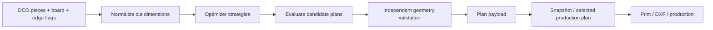

# 05 — القص والرسم وDXF

> **Status:** Canonical  
> **Audience:** مدخل البيانات، عامل الرسم/CNC، developers, QA

## 1. هدف هذه المنطقة

مدخل البيانات يحتاج رسمًا توضيحيًا سريعًا للدرفة الخاصة، بينما التخطيط/التصنيع يحتاج Geometry دقيقة قابلة للتحقق. لذلك يجب الفصل بين **سهولة الإدخال** و**صحة بيانات الإنتاج** دون جعل المستخدم العادي يعمل كمهندس CAD.

## 2. وحدات القياس

- إدخال قياسات القطع في واجهة الطلب يكون بالمقاييس التجارية المعتمدة في DCO (عادة cm في حقول القطع الحالية).
- DXF والإحداثيات الهندسية التشغيلية تستخدم **mm**.
- التحويل بين الوحدات يجب أن يكون في طبقة واحدة معروفة، لا في عدة UI functions مستقلة.

## 3. Cutting pipeline

المحرك يعيش أساسًا تحت:

- `domain/cutting/`
- `application/cutting/`
- Adapters في `infrastructure/cutting/` و`infrastructure/frappe/orders/`.

## 4. القشاط ومقاسات القص

القشاط ليس مجرد رسم بصري. اختيار القشاط/سماكته يؤثر على **Cut dimensions** حسب قواعد Domain. لذلك:

- UI يجمع side flags/type.
- Domain يحسب أبعاد القص.
- Plan/DXF/printing يجب أن تستهلك نفس النتيجة، لا تعيد حسابها بصيغ مختلفة.

عند تغيير قاعدة سماكة القشاط، اختبر Order entry + optimizer + print + DXF معًا.

## 5. Special shapes

هناك قطع Regular، clipped-corner (قطر)، L-shaped corner (زاوية قائمة)، وSpecial/custom geometry. قواعد الصلاحية/الهندسة يجب أن تبقى Server-side. الزاوية المقصوصة وزاوية L نوعان parametric مستقلان يشتركان في الحقول الثلاثة `clipped_corner_position` / `clipped_corner_width_cm` / `clipped_corner_length_cm` وفي مسار التحقق والتسعير والخطة/DXF؛ الفرق الوحيد هو مضلع القص: خمسة رؤوس بوتر قطري مقابل ستة رؤوس بضلعين متعامدين. واجهة «توثيق الدرفة الخاصة» تجمع صورة العميل والملاحظات والقياسات فقط، ولا تنتج geometry للتصنيع. أي `special_shape_geometry_json` أو DXF دقيق يأتي من مسار المصمم/التصنيع المستقل ويخضع للـvalidation حتى لو بدا الشكل صحيحًا في Canvas.

عند استيراد DXF، قطعة `Special` تعني **شكلًا حرًا داخل مقاس تصنيع ثابت**. يجوز أن يكون المحيط الخارجي نجمة أو حرف `L` أو شكلًا مقعرًا أو أي Polygon مغلق صالح، ولا يشترط أن يكون مستطيلاً. لكن `Bounding Box` للمحيط الخارجي يجب أن يطابق `cut_width_cm × cut_length_cm` المحفوظين للقطعة ضمن عقد الاستيراد، أو يطابقهما بعد التدوير فقط عندما يكون `allow_rotation` مفعّلًا. لا يجوز أن تتحول حرية الشكل إلى تجاوز لمقاس القص التصنيعي. تبقى الفتحات الداخلية مملوكة لمحيط خارجي واحد، وإذا لم تستطع أدلة الطلب والبنية الهندسية التمييز يقينًا بين فتحة وقطعة مستقلة يفشل الاستيراد صراحة بدل التخمين.

الصورة المرجعية في واجهة التوثيق تدعم اقتصاصًا غير تدميري: يبقى الملف الخاص الأصلي محفوظًا كما هو، بينما تُحفظ حدود الاقتصاص النسبية وأبعاد الصورة داخل عقد التوثيق. الاقتصاص اليدوي هو المرجع النهائي، ويمكن للاقتصاص التلقائي اقتراح إزالة الهوامش البيضاء فقط؛ يجب أن يبقى الاقتراح قابلًا للتعديل قبل تطبيقه حتى لا تضيع خطوط الرسم الخفيفة. الطباعة تستهلك نفس حدود الاقتصاص، ولا يحول ذلك الصورة أو الرسم إلى Geometry تصنيع.

## 6. System plan وCustom/Uploaded plan

النظام قد يحتفظ بأكثر من مصدر لخطة القص لأغراض المقارنة والعمل:

- System-generated plan.
- Custom/uploaded DXF-derived plan.
- Approved production plan.

المستخدم يحتاج Capabilities مختلفة للعرض/إعادة الحساب/الرفع/الاعتماد. اعتماد الخطة هو نقطة تثبيت لما سيغادر مرحلة التخطيط إلى الإنتاج.

## 7. Canonical Plan Settings

إعدادات خطة القص لها عقد Domain واحد تحت `domain/cutting/plan_settings.py`. القيم الأساسية هي:

- `optimization_mode`
- `machine_type`
- `optimization_time_limit_sec`
- `kerf_mm`
- `preferred_trim_mm`

القواعد:

- `kerf_mm >= 0`، والقيمة `0` قيمة صحيحة وتبقى `0` حتى محرك القص.
- `preferred_trim_mm >= 0`، والقيمة `0` قيمة صحيحة وتعني عدم تطبيق هامش التشذيب المفضل.
- `optimization_time_limit_sec` يجب أن يكون رقمًا finite وأكبر من `0`.
- لا يجوز استخدام falsy fallback من نوع `value or default` لاستبدال صفر صحيح بقيمة افتراضية.
- Factory Production Settings هي **defaults لأول Cutting Plan بلا lineage فقط**. بعد وجود Plan تصبح إعداداتها وإعدادات revisions اللاحقة مملوكة للـPlan lineage ولا تتغير عند تعديل defaults المصنع.
- Preview والحساب النهائي يستهلكان نفس `PlanSettings` validated contract؛ لا يملك أي منهما قواعد normalization مستقلة.
- Frappe metadata ليست سلطة Business Validation. حقل التخزين التاريخي `trim_margin_mm` يمثل `preferred_trim_mm` عند حدود Frappe فقط ولا يغيّر معنى العقد في Domain.

## 8. Adaptive Trim

Adaptive Trim هو Business Rule صريح تحت `domain/cutting/adaptive_trim.py`، وليس Strategy قص مستقلة ولا سلوكًا مخفيًا داخل optimizer.

- **Preferred Trim** هو `preferred_trim_mm` القادم من `PlanSettings` والمملوك لـCutting Plan lineage.
- **Applied Trim** هو الهامش الفعلي الذي استُخدم في الخطة المحسوبة بعد تطبيق Adaptive Trim.
- يبدأ القرار دائمًا بالـPreferred Trim كاملًا على محوري العرض والطول.
- لا يُخفّض الهامش إلا إذا كان ذلك يحسن feasibility أو يمنع لوحًا إضافيًا غير ضروري.
- عند الحاجة إلى relaxation، يُخفّض محور العرض أو الطول فقط إذا كان هذا المحور هو الذي يحتاجه الحل؛ لا يُخفّض المحوران معًا إلا إذا تطلبت الهندسة ذلك.
- يحتفظ القرار بأكبر Applied Trim ممكن بدقة `0.1 mm` بدل القفز مباشرة إلى الصفر.
- ترتيب القرار deterministic: width-only ثم length-only ثم both، وبعدها refinement للمحاور التي ثبت أنها تحتاج relaxation.
- كل probe/refinement/final evaluation يستخدم **نفس `optimization_mode` الذي اختاره المستخدم** ونفس machine/time-limit/options. Adaptive Trim لا يبدّل الخوارزمية سرًا إلى `Auto` أو غيرها.
- `kerf_mm` لا يُخفّض ولا يُعدّل مطلقًا بواسطة Adaptive Trim؛ كل evaluations تستخدم Kerf نفسها.
- أبعاد اللوح الفيزيائية `full_*` لا تتغير. الذي يتغير فقط هو `usable_*` الناتج عن Applied Trim.
- نتيجة القرار تُحفظ داخل Plan snapshot في `trim_policy` مع Preferred Trim، Applied width/length trim، المحاور المخفّضة، precision، وجودة الخطة قبل/بعد. وتبقى مفاتيح `applied_trim_*` و`margin_policy` القديمة للتوافق مع القراء الحاليين.
- أي validation أو DXF path يعتمد حدود المساحة القابلة للاستخدام يجب أن يستهلك **Applied Trim / usable dimensions** من نتيجة الخطة، وألا يعيد فرض Preferred Trim بعد الحساب.

## 9. CuttingExecutionTrace

كل System Cutting Plan محسوبة تملك عقد Application واحدًا immutable وversioned باسم `CuttingExecutionTrace` تحت `application/cutting/execution_trace.py`.

قواعد الملكية والتنفيذ:

- يُبنى الـTrace **مرة واحدة فقط** بعد اكتمال التنفيذ الفعلي، من نفس `PlanSettings` canonical التي دخلت الحساب + `AdaptiveTrimDecision` الحقيقي + نتيجة الـoptimizer النهائية الحقيقية.
- لا تعيد Service أو Preview أو Commit أو JavaScript بناء الـTrace أو استنتاجه من حقول متفرقة.
- يُحفظ داخل الـPlan snapshot تحت `execution_trace`؛ لا توجد له DocType أو table أو persistence model مستقلة.
- Preview يجمد الـsnapshot كاملة بما فيها `execution_trace` داخل Preview Session الموثوقة.
- Commit يثبت **نفس snapshot ونفس execution_trace حرفيًا** ولا يعيد تشغيل optimizer.
- `execution_trace.version` هو version عقد الـTrace وليس engine version. `engine_version` يبقى محفوظًا بشكل مستقل.
- `requested` يسجل القيم canonical التي طلبها المستخدم/الخطة: optimization mode، machine type، Kerf، Preferred Trim، وtime limit.
- `optimizer` يسجل نفس inputs التي دخلت التنفيذ بالإضافة إلى النتيجة الفعلية: actual optimization mode، winning low-level `method_key`/`method_label`، ordering strategy، attempts، elapsed time، reported search limit، solver status/wall time عند توفرها.
- `adaptive_trim` يسجل Applied Trim لكل محور، هل تم relaxation، المحاور المتأثرة، جودة الخطة قبل/بعد، وسبب القرار المستقر: `preferred_retained` أو `improved_feasibility` أو `avoided_extra_board`.
- الواجهة تعرض هذا العقد Presentation فقط، ولا تقارن Preferred/Applied Trim بنفسها ولا تستنتج سبب القرار.
- الحقول التاريخية الحالية في snapshot مثل `optimization_mode`, `method_key`, `method_label`, `attempts`, `trim_policy`, `margin_policy`, و`applied_trim_*` تبقى للتوافق الخلفي ولا تُزال ضمن هذا العقد.

## 10. Plan immutability

بعد اعتماد Production plan:

- لا يعاد تشغيل optimizer تلقائيًا لعرض تاريخ قديم.
- Snapshot المعتمد يجب أن يمثل ما تم اعتماده فعليًا.
- أي تغيير Geometry جوهري لاحق يجب أن يعلّم الخطة بحاجة لإعادة حساب/اعتماد وفق workflow.
- Operational snapshots لا تستخدم كقناة لتسريب التكلفة الداخلية.

## 11. DXF layers والعقد الهندسي

العقد الحالي يستخدم طبقات واضحة مثل:

- `SHEET_OUTLINE`
- `CUT_PATH`

DXF importer يدعم قراءة Geometry ثم يطبق validation مستقلًا، بما في ذلك حسب الحالة:

- contour connectivity/valid polygons.
- sheet bounds.
- overlap بين القطع.
- dimensions والتسامحات.
- rotation المسموح/الممنوع.
- matching عدد القطع مع الطلب.
- kerf/geometric distance rules.
- supported entity types/layers.

لا تعتبر “الملف فتح في AutoCAD” دليلاً كافيًا أنه صالح للإنتاج.

## 12. Drawing/DXF authorization

لأفعال عامل الرسم لا تكفي Capability وحدها دائمًا. العقد الحالي يجمع:

- الطلب في Drawing/planning stage.
- current assignee هو المستخدم عند الفعل المخصص للعامل.
- الـCapability المناسبة (`view_drawing_workspace`, `edit_special_drawing`, `upload_dxf`, ...).
- إذا كان Production DXF موجودًا، الاستبدال يحتاج `replace_dxf` بدل معاملته كرفع أول.
- Plan approval/status قد يقفل بعض الأفعال.

Stage 14 يثبت أن CNC لا يستطيع التصرف كعامل الرسم لمجرد معرفته بالطلب.

## 13. Files ليست سلطة

أي File/DXF مرتبط بالطلب يجب التحقق من parent/order scope وprivate/attachment behavior المعتمد. لا تنشئ endpoint يأخذ `file_url` أو `file_name` ثم يقرأه بدون إثبات علاقته بالـDCO المسموح للمستخدم.

## 14. أين أعدل؟

| نوع التغيير | المكان المفضل |
|---|---|
| Geometry rule | `domain/cutting/` أو `domain/orders/` |
| Use case plan | `application/cutting/` / `application/orders/` |
| DXF parser adapter | `infrastructure/cutting/` |
| Frappe plan persistence | `infrastructure/frappe/orders/` |
| Endpoint/auth wiring | `services/dxf_*`, `drawing_*`, plan services |
| Canvas/UI behavior | presentation/JS بعد تثبيت contract server-side |

## 15. اختبارات مطلوبة عادة

أي تغيير في هذه المنطقة يجب أن يفكر في:

- geometry unit tests.
- optimizer regression.
- cut dimensions/edge deductions.
- DXF import/export validation.
- drawing authorization.
- plan snapshot security.
- Special Shape Documentation checks إذا تغير محرر التوثيق.
- Frappe integration إذا تغير persistence/schema/files.

## 16. عرض هندسة القطع في الخطة

- هندسة DXF المقبولة تُحفظ في `sheets[].pieces[].geometry` بعقد versioned، بوحدة `mm` وفي إحداثيات `usable_sheet`. هذا الـsnapshot هو مصدر الحقيقة للعرض وإعادة الفتح والطباعة والنسخ المعتمدة.
- `outer` و`holes` هما تمثيل `PartGeometry` الحالي. المنحنيات تُعرض من نفس النقاط التي أنتجها DXF reader بسماحية التسطيح المعتمدة؛ لا تعيد طبقة العرض قراءة DXF أو تقريب المنحنى بعقد آخر.
- `door_cutting_order_piece_geometry.js` هو compatibility adapter نقي يحول هندسة DXF، وSpecial اليدوية، والزاوية، والمستطيل التاريخي إلى `PieceRenderModel` واحد يفصل الشكل المحلي عن `PiecePlacement`.
- هندسة DXF المخزنة تكون مطبّقًا عليها موضع الرسم الفعلي أصلًا. يحولها adapter إلى شكل محلي عبر طرح حدودها، ويستخرج placement من حدودها دون إعادة تطبيق `rotated`؛ منع الدوران المزدوج جزء من العقد.
- النظام optimizer يدعم حاليًا 0°/90° عبر `rotated` ولا يملك mirror أو حالات 180°/270° مستقلة. لا يجوز لطبقة العرض اختراع تحويل غير موجود في الخطة.
- web وprint يستهلكان `geometry.pathData` نفسها كـSVG vector. الفتحات تُعرض بـ`evenodd`، ورقم القطعة يستخدم visual-center داخل المادة بدل مركز bounding box عند الأشكال غير المنتظمة.
- دلالات القشاط الحالية تبقى `top/bottom/left/right`. للأشكال غير المنتظمة تُقص المؤشرات ضمن مادة المسار الحقيقي، من دون ترحيل مدمر أو اختراع ربط جديد بين القشاط وكل segment.
- وجود عقد `geometry` معلن لكنه غير صالح لا يتحول بصمت إلى قطعة صحيحة؛ يظهر fallback تشخيصي. أما snapshots القديمة التي لا تعلن الهندسة فتستمر بالمستطيل أو عقد Special/Corner التوافقية.
