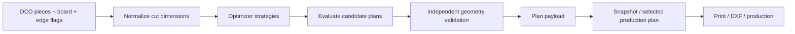

# 05 — القص والرسم وDXF

> **Status:** Canonical  
> **Audience:** مدخل البيانات، عامل الرسم/CNC، developers, QA

## 1. هدف هذه المنطقة

مدخل البيانات يحتاج رسمًا توضيحيًا سريعًا للدرفة الخاصة، بينما التخطيط/التصنيع يحتاج Geometry دقيقة قابلة للتحقق. لذلك يجب الفصل بين **سهولة الإدخال** و**صحة بيانات الإنتاج** دون جعل المستخدم العادي يعمل كمهندس CAD.

## 2. وحدات القياس

- إدخال قياسات القطع في واجهة الطلب يكون بالمقاييس التجارية المعتمدة في DCO (عادة cm في حقول القطع الحالية).
- DXF والإحداثيات الهندسية التشغيلية تستخدم **mm**.
- التحويل بين الوحدات يجب أن يكون في طبقة واحدة معروفة، لا في عدة UI functions مستقلة.

## 3. Cutting pipeline

المحرك يعيش أساسًا تحت:

- `domain/cutting/`
- `application/cutting/`
- Adapters في `infrastructure/cutting/` و`infrastructure/frappe/orders/`.

## 4. القشاط ومقاسات القص

القشاط ليس مجرد رسم بصري. اختيار القشاط/سماكته يؤثر على **Cut dimensions** حسب قواعد Domain. لذلك:

- UI يجمع side flags/type.
- Domain يحسب أبعاد القص.
- Plan/DXF/printing يجب أن تستهلك نفس النتيجة، لا تعيد حسابها بصيغ مختلفة.

عند تغيير قاعدة سماكة القشاط، اختبر Order entry + optimizer + print + DXF معًا.

## 5. Special shapes

هناك قطع Regular، clipped-corner، وSpecial/custom geometry. قواعد الصلاحية/الهندسة يجب أن تبقى Server-side. واجهة «توثيق الدرفة الخاصة» تجمع صورة العميل والملاحظات والقياسات فقط، ولا تنتج geometry للتصنيع. أي `special_shape_geometry_json` أو DXF دقيق يأتي من مسار المصمم/التصنيع المستقل ويخضع للـvalidation حتى لو بدا الشكل صحيحًا في Canvas.

الصورة المرجعية في واجهة التوثيق تدعم اقتصاصًا غير تدميري: يبقى الملف الخاص الأصلي محفوظًا كما هو، بينما تُحفظ حدود الاقتصاص النسبية وأبعاد الصورة داخل عقد التوثيق. الاقتصاص اليدوي هو المرجع النهائي، ويمكن للاقتصاص التلقائي اقتراح إزالة الهوامش البيضاء فقط؛ يجب أن يبقى الاقتراح قابلًا للتعديل قبل تطبيقه حتى لا تضيع خطوط الرسم الخفيفة. الطباعة تستهلك نفس حدود الاقتصاص، ولا يحول ذلك الصورة أو الرسم إلى Geometry تصنيع.

## 6. System plan وCustom/Uploaded plan

النظام قد يحتفظ بأكثر من مصدر لخطة القص لأغراض المقارنة والعمل:

- System-generated plan.
- Custom/uploaded DXF-derived plan.
- Approved production plan.

المستخدم يحتاج Capabilities مختلفة للعرض/إعادة الحساب/الرفع/الاعتماد. اعتماد الخطة هو نقطة تثبيت لما سيغادر مرحلة التخطيط إلى الإنتاج.

## 7. Plan immutability

بعد اعتماد Production plan:

- لا يعاد تشغيل optimizer تلقائيًا لعرض تاريخ قديم.
- Snapshot المعتمد يجب أن يمثل ما تم اعتماده فعليًا.
- أي تغيير Geometry جوهري لاحق يجب أن يعلّم الخطة بحاجة لإعادة حساب/اعتماد وفق workflow.
- Operational snapshots لا تستخدم كقناة لتسريب التكلفة الداخلية.

## 8. DXF layers والعقد الهندسي

العقد الحالي يستخدم طبقات واضحة مثل:

- `SHEET_OUTLINE`
- `CUT_PATH`

DXF importer يدعم قراءة Geometry ثم يطبق validation مستقلًا، بما في ذلك حسب الحالة:

- contour connectivity/valid polygons.
- sheet bounds.
- overlap بين القطع.
- dimensions والتسامحات.
- rotation المسموح/الممنوع.
- matching عدد القطع مع الطلب.
- kerf/geometric distance rules.
- supported entity types/layers.

لا تعتبر “الملف فتح في AutoCAD” دليلاً كافيًا أنه صالح للإنتاج.

## 9. Drawing/DXF authorization

لأفعال عامل الرسم لا تكفي Capability وحدها دائمًا. العقد الحالي يجمع:

- الطلب في Drawing/planning stage.
- current assignee هو المستخدم عند الفعل المخصص للعامل.
- الـCapability المناسبة (`view_drawing_workspace`, `edit_special_drawing`, `upload_dxf`, ...).
- إذا كان Production DXF موجودًا، الاستبدال يحتاج `replace_dxf` بدل معاملته كرفع أول.
- Plan approval/status قد يقفل بعض الأفعال.

Stage 14 يثبت أن CNC لا يستطيع التصرف كعامل الرسم لمجرد معرفته بالطلب.

## 10. Files ليست سلطة

أي File/DXF مرتبط بالطلب يجب التحقق من parent/order scope وprivate/attachment behavior المعتمد. لا تنشئ endpoint يأخذ `file_url` أو `file_name` ثم يقرأه بدون إثبات علاقته بالـDCO المسموح للمستخدم.

## 11. أين أعدل؟

| نوع التغيير | المكان المفضل |
|---|---|
| Geometry rule | `domain/cutting/` أو `domain/orders/` |
| Use case plan | `application/cutting/` / `application/orders/` |
| DXF parser adapter | `infrastructure/cutting/` |
| Frappe plan persistence | `infrastructure/frappe/orders/` |
| Endpoint/auth wiring | `services/dxf_*`, `drawing_*`, plan services |
| Canvas/UI behavior | presentation/JS بعد تثبيت contract server-side |

## 12. اختبارات مطلوبة عادة

أي تغيير في هذه المنطقة يجب أن يفكر في:

- geometry unit tests.
- optimizer regression.
- cut dimensions/edge deductions.
- DXF import/export validation.
- drawing authorization.
- plan snapshot security.
- Special Shape Documentation checks إذا تغير محرر التوثيق.
- Frappe integration إذا تغير persistence/schema/files.
