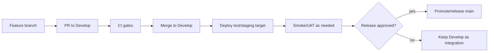

# 09 — التشغيل والإصدارات

> **Status:** Canonical release policy  
> **Audience:** DevOps, maintainers, release owners

هذه الوثيقة تصف **Contract الإصدار** ولا تحتوي Secrets أو تفاصيل خادم خاصة ببيئة واحدة.

## 1. الفروع

- `Develop`: Integration branch للتطوير المختبر.
- Feature branches: العمل الجاري وPRs.
- `main`: Release/promotion branch فقط، ولا يُعدّل لمجرد انتهاء Feature ما لم يصدر قرار Release صريح.

## 2. رحلة التغيير إلى الإنتاج



## 3. قبل Deployment

- حدد exact Git SHA، لا “latest” فقط.
- راجع PR/Diff.
- تحقق من CI على نفس SHA.
- اعرف هل هناك schema/patch/migration.
- خذ Backup مناسب قبل Migration عالية الأثر.
- تأكد أن rollback path معروف.

## 4. Frappe migration contract

الأوامر الدقيقة قد تختلف حسب Docker/Bench wrapper للبيئة، لكن التسلسل المنطقي:

```text
fetch/build exact app revision
install app only for new site
bench --site <site> migrate
build/refresh assets when frontend assets changed
clear/reload caches when required
restart relevant workers/services
ensure the Frappe `long` queue worker is running; Save-triggered System plan recalculation is enqueued there and will stay queued if no worker is available
smoke test
```

لا تنسخ أوامر `SETUP_v1.0.md` القديمة بشكل أعمى إذا تعارضت مع البيئة الحالية.

## 5. Migration rules

- Patch يجب أن يكون idempotent.
- اختبر `migrate` مرتين في CI.
- لا تعيد حساب historical approved snapshots بلا قرار migration صريح.
- إذا تغير معنى Field وليس شكله فقط، اكتب خطة data transition.
- بعد destructive migration، code rollback وحده قد لا يكفي؛ خطط للبيانات أيضًا.

## 6. Assets/UI

عند تعديل JS/CSS/workspace assets:

- تأكد أن build pipeline للبيئة أخذ commit الجديد.
- لا تشخص stale browser asset كـBusiness bug قبل فحص cache/build.
- لكن لا تستخدم cache كتبرير لبيانات DCO خاطئة بعد navigation؛ افصل asset-cache عن client state bug.

### إصدار تطبيق سكانر Windows

- ابنِ `AlmdinaScannerBridgeSetup.exe` من Workflow `Windows Scanner Bridge` على SHA المرشح نفسه.
- Artifact غير الموقّع مخصص لـUAT فقط؛ إصدار الموظفين يجب أن يمر بتوقيع Authenticode وtimestamp، ويمنع الـWorkflow نشر Release بلا توقيع.
- انشر tag بالشكل `scanner-bridge-v*` ليصبح المثبت الموقّع في رابط GitHub Release الثابت الذي تعرضه الواجهة.
- اختبر التثبيت per-user، التشغيل مع تسجيل الدخول، `/health`، WIA، الإلغاء، والإزالة على جهاز Windows فعلي.
- التطبيق لا يحتاج migration أو صلاحية مدير، ولا يجوز استبدال loopback بعنوان شبكي.

## 7. Smoke checklist

بعد deployment مهم، اختبر بحسابات غير Administrator أيضًا:

- Login/Desk/workspace.
- فتح DCO صحيح بالاسم وعدم ظهور بيانات طلب سابق.
- إنشاء/تعديل طلب حسب persona.
- Cutting Plan tab.
- Cost visibility للشخص المالي وعدم ظهورها للعامل.
- Shop Floor inbox للـassignee الصحيح.
- Start/Handoff إن كان release يمس الإنتاج.
- DXF/print إذا كانت الملفات تغيرت.
- Permission page إذا مس التغيير الصلاحيات.

## 8. Rollback

الـRollback المهني يحدد مسبقًا:

- previous known-good app SHA/image.
- DB backup point.
- هل migration backward-compatible؟
- هل ملفات/attachments تغيرت؟
- ما smoke tests بعد rollback؟

لا تعد بـRollback لحظي إذا كان migration غير قابل للعكس.

## 9. Logs وتشخيص المشاكل

عند incident اجمع:

- exact SHA/image.
- user/persona.
- DCO/stage identifiers.
- request/endpoint إن أمكن.
- browser/server error.
- whether refresh changes result.
- relevant worker/web logs, including the Frappe `long` queue if Cutting Plan save-recalculation did not start.

تجنب تعديل عدة طبقات “للتجربة” قبل تحديد أول boundary يظهر فيها السلوك الخاطئ.

## 10. أسرار وإعدادات بيئية

- لا تضع passwords/tokens في repository docs.
- Server-specific paths/scripts يمكن توثيقها في Runbook خاص بالبيئة إذا لزم، لكن لا تجعل Architecture المرجعية تعتمد على اسم خادم واحد.
- Secrets تبقى في environment/secret management المعتمد.
- تكامل WhatsApp المحلي (OpenWA) يقرأ `OPENWA_BASE_URL` و`OPENWA_API_KEY` من متغيرات البيئة أو ملف `.env` في جذر التطبيق. القالب الملتزم هو `.env.example` فقط؛ ملف `.env` نفسه لا يُرفع. المفتاح لا يُرسل إلى المتصفح ولا يُحفظ في `Almdina ERP Settings`. جلسة المصنع تُدار من صفحة إعدادات المعمل لمن يملك `manage_whatsapp_session`، والحالة الحية تأتي من OpenWA. نص القياسات (أول إرسال وتعديلات لاحقة) والفاتورة يُرفق مع ملف PDF في رسالة واحدة بحد 1024 حرفًا، ورسائل إتمام المراحل المفعّلة على المسار تبقى نصًا مستقلًا. تُضبط كلها من قسم رسائل واتساب في الإعدادات (`edit_whatsapp_messages`؛ `{order_name}` لرقم الطلب و`{stage_label}` لاسم المرحلة). ملف القياسات المرسل هو نفس مستند طباعة جدول القياسات (ليس Print Format `Door Cutting Measurements`): يُبنى HTML على الخادم ثم يُحوَّل إلى PDF عبر Chromium المضمّن في الـbench (`--print-to-pdf`) ثم يرجع إلى `frappe.utils.pdf.get_pdf` لنفس HTML إن لزم. فاتورة الزبون عبر واتساب تُبنى بنفس الآلية من مستند الطباعة الموحّد (قياسات + عرض السعر المعتمد) وتحتاج `print_customer_invoice`. يجب أن يتوفر مساحة قرص كافية لملفات PDF المؤقتة.

## 11. Release note المطلوبة

لكل Release اذكر:

- from SHA -> to SHA.
- migrations/patches.
- user-visible changes.
- permission/security changes.
- known risks.
- CI/UAT evidence.
- rollback target.
