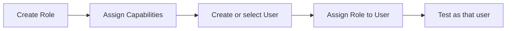

# 11 — دليل المهام اليومية

> **Status:** Canonical operational guide  
> **Audience:** الموظف الجديد، مدخل البيانات، مشرف الإنتاج، مسؤول الصلاحيات، Support

هذا الدليل يشرح **ماذا يجب أن يحدث** في المهام اليومية وأين تبدأ. لا يعتمد على موضع زر بصري قد يتغير مع تحسين UI، لذلك يبقى صالحًا كمرجع حتى مع إعادة ترتيب الواجهات.

## 1. قبل أي مهمة: افهم سياقك

قبل أن تقول “النظام لا يسمح لي”، حدد أربع معلومات:

1. من هو المستخدم الحالي وما Roles الخاصة به؟
2. ما Capability المطلوبة للفعل؟
3. ما حالة الطلب/المرحلة الحالية؟
4. هل المهمة مسندة لهذا المستخدم فعلًا؟

كثير من الحالات الصحيحة أمنيًا تبدو للمستخدم كزر مخفي أو فعل غير متاح لأن شرطًا من هذه الشروط غير متحقق.

## 2. إنشاء طلب جديد — مدخل البيانات

**الهدف:** تسجيل طلب الزبون والقياسات بصورة صحيحة قبل التخطيط.

### المسار المنطقي

1. افتح `Door Cutting Order` من واجهة Almdina ERP.
2. أدخل بيانات الزبون ووصف اللوح الحر والأبعاد المطلوبة.
3. أدخل الدرف/القطع: العرض، الطول، الكمية، الشكل، التدوير، الملاحظات.
4. حدد القشاط لكل ضلع حسب الطلب.
5. راجع الأرقام قبل الحفظ، خصوصًا القياسات والكمية.
6. احفظ الطلب.
7. إذا كان هناك رسم خاص، انتقل لمسار الرسم المخصص بدل كتابة وصف غامض فقط.
8. احسب/راجع Cutting Plan قبل Dispatch إلى الإنتاج.

### النتيجة المتوقعة

- DCO محفوظ بهوية ثابتة.
- القياسات والقشاط موجودان كمصدر التخطيط.
- أي تغيير يؤثر على الخطة سيظهر كحاجة لإعادة الحساب حسب العقد الحالي.

### لا تفعل

- لا تختَر Stock Item بدل وصف اللوح لمجرد وجود كود مخزون تاريخي.
- لا تغيّر تكلفة داخلية إذا لم تكن مخولًا ماليًا.
- لا تتجاوز validation بإدخال Geometry في مكان ملاحظات فقط إذا كان الشكل يحتاج رسمًا فعليًا.

## 3. توثيق درفة خاصة — مدخل البيانات/عامل الرسم

**الهدف:** نقل شكل الزبون بطريقة واضحة وقابلة للتحقق.

1. افتح الطلب الصحيح وتأكد من رقم DCO ورقم الدرفة.
2. افتح «توثيق الدرفة الخاصة» من سطر الدرفة.
3. ابدأ بصورة مرفوعة، أو **مسح بالسكانر**، أو الكاميرا، أو شكل جاهز، أو قلم ذكي.
4. إذا ظهر أن برنامج السكانر غير مثبت، استخدم رابط التثبيت مرة واحدة؛ بعد ذلك يبدأ البرنامج تلقائيًا مع Windows ولا يحتاج PowerShell.
5. أضف القياسات والملاحظات التي يحتاجها المصمم، ثم احفظ التوثيق.
6. راجع أن التوثيق مرتبط بالطلب والدرفة الحاليين وليس طلبًا سبق فتحه.
7. إذا كانت الخطة ستعتمد على DXF خارجي، يجهزه المصمم ويرفعه فقط ضمن مسار التصنيع وصلاحيته المستقلين.

**مهم:** هذا توثيق لطلب العميل وليس ملف تصنيع، ولا يُحوّل القلم أو الصورة إلى DXF.

## 4. حساب ومراجعة Cutting Plan

**الهدف:** الوصول إلى توزيع صالح قبل الإنتاج.

1. تأكد أن القياسات، board dimensions، kerf/trim والإعدادات المطلوبة صحيحة.
2. شغّل إعادة الحساب إذا كان المستخدم يملك `recalculate_plan`.
3. راجع عدد الألواح والقطع غير الموضوعة وGeometry.
4. إذا كان هناك System plan وUploaded/Custom plan، قارن المصادر التي تسمح بها صلاحياتك.
5. عند استخدام Planning Stage، اعتمد Production plan المختارة قبل Handoff للمرحلة التالية.

### إذا ظهرت “الخطة تحتاج إعادة حساب”

لا تُكمل بالإجبار. ارجع للمدخل الذي تغيّر، أعد الحساب ثم أعد الاعتماد عند الحاجة.

## 5. إرسال الطلب إلى الإنتاج — المشرف

**الهدف:** إنشاء أول Production Stage وإسنادها للعامل الصحيح.

المشرف يحتاج `dispatch_order`، والطلب يحتاج خطة قص صالحة وغير stale.

1. اختر Production Routing المناسب.
2. النظام يحدد أول Stage من Route؛ لا تفترض اسم قسم ثابت.
3. اختر عاملًا يملك `operational_role` المطلوبة لهذه المرحلة.
4. نفذ Dispatch.
5. تحقق أن الطلب ظهر في Inbox العامل المسند إليه.

إذا كان Route يبدأ Planning Stage، ستظهر مرحلة الرسم/التخطيط أولًا؛ اعتماد الخطة قبل مغادرتها يبقى إلزاميًا.

## 6. تنفيذ عمل العامل — Shop Floor

**الهدف:** كل عامل يرى ويعالج العمل المسند له فقط.

1. افتح `shop_floor_inbox` / Shop Floor.
2. افتح المهمة الحالية المسندة إليك.
3. Start عندما تكون المرحلة قابلة للبدء.
4. نفذ العمل الفعلي.
5. Handoff/Finish عندما تصبح المرحلة جاهزة.
6. بعد الإنهاء يجب أن تغادر المهمة Inbox وتظهر في التاريخ/Archive، بينما تنتقل المرحلة التالية للعامل التالي.

إذا كنت تملك Role القسم لكن المهمة ليست مسندة إليك، فهذا لا يمنحك حق تنفيذها تلقائيًا.

## 7. إعادة إسناد عامل — المشرف

استخدم `reassign_worker` فقط لمرحلة نشطة وبسياق إشرافي مخول. اختر مستخدمًا مناسبًا للدور التشغيلي للمرحلة.

لا تغيّر assignee مباشرة من قاعدة البيانات لتجاوز سياسة المرحلة؛ ذلك يفقد audit والضوابط.

## 8. إنشاء/تعديل Production Routing

من `factory_master_data`/واجهة إدارة المسارات وفق الصلاحية:

1. أنشئ Route باسم واضح.
2. أضف المراحل بترتيب sequence صاعد وفريد.
3. حدد `stage_type` واسم القسم الظاهر و`operational_role` لكل مرحلة.
4. إذا كانت هناك Planning Stage، يجب أن تكون الأولى ويوجد واحدة فقط.
5. احفظ واختبر route على طلب تجريبي قبل اعتماده في العمل اليومي.

لا تجعل UI أو كود جديد يعيد كتابة ترتيب ثابت يناقض Route.

## 9. إنشاء Role وإعطاء الصلاحيات ثم إنشاء User

هذا هو التسلسل الإداري المرجعي:



### Role

اسم يجمع مجموعة صلاحيات. اختر اسمًا وظيفيًا مفهومًا للمؤسسة.

### Capabilities

من `factory_permissions` أعط الدور الأفعال التي يحتاجها فقط. لا تعط `view_costs` أو `manage_permissions` لمجرد حل زر مفقود.

### User

من `factory_workforce`/إدارة المستخدمين أنشئ أو اختر المستخدم ثم أسند Roles المناسبة.

### الاختبار

اختبر بالحساب نفسه، لا Administrator فقط. تأكد من البيانات التي يراها، الأزرار التي يستطيع استخدامها، والطلبات المسندة إليه.

## 10. التكلفة ومستندات الزبون

- مستند الزبون Customer-facing ليس هو Internal cost report.
- المستخدم الذي يطبع مستند الزبون لا يحتاج تلقائيًا `view_costs`.
- بيانات التكلفة الداخلية يجب أن تبقى غير موجودة في payload/print لغير المخولين، لا مجرد مخفية بصريًا.

عند الشك: اختبر نفس DCO بحساب مالي وحساب تشغيلي وقارن ما يجب أن يظهر لكل منهما.

## 11. Incident وReplacement

عند خطأ إنتاج فعلي:

1. سجل Incident على الطلب/القطعة/المرحلة الصحيحة إذا كنت مخولًا.
2. أنشئ Replacement من السياق الصحيح بدل إنشاء قطعة منفصلة بلا أصل.
3. اتبع Approval/Start/Complete/Cancel الخاص بالتعويض حسب Capabilities.
4. حافظ على الربط بالقطعة والطلب الأصليين لتبقى التكلفة والتاريخ والتدقيق صحيحة.

## 12. إنهاء وتسليم الطلب

اكتمال آخر Production Stage يحول الطلب إلى `Ready for Delivery`. تأكيد التسليم يحتاج `mark_delivered` ويحوّل الحالة إلى `Delivered`.

لا تعتبر نهاية مرحلة وسطية “تسليمًا” حتى لو كان العمل في ذلك القسم قد انتهى.

## 13. تدريب موظف جديد — Checklist

- يعرف الفرق بين Role وCapability وAssignment.
- يستطيع فتح DCO الصحيح والتحقق من رقمه.
- يفهم أين يدخل القياسات والقشاط.
- يعرف متى يحتاج رسمًا خاصًا.
- يعرف أن Cutting Plan يجب أن تكون صالحة قبل Dispatch.
- يعرف أن العامل ينفذ المهمة المسندة إليه فقط.
- يعرف أين يجد Inbox وArchive.
- لا يتوقع رؤية التكلفة الداخلية بدون صلاحية.
- يعرف ماذا يسجل قبل طلب الدعم.

## 14. عندما تحتاج دعمًا

لا ترسل فقط “الزر لا يعمل”. أرسل:

```text
User/persona:
DCO:
Current order status:
Current stage + assignee (إن وجدت):
What I expected:
What actually happened:
Exact steps to reproduce:
Does refresh change the result?:
Screenshot/video/error message:
Approximate time of occurrence:
```

ثم راجع [دليل التشخيص](12_TROUBLESHOOTING.md).
