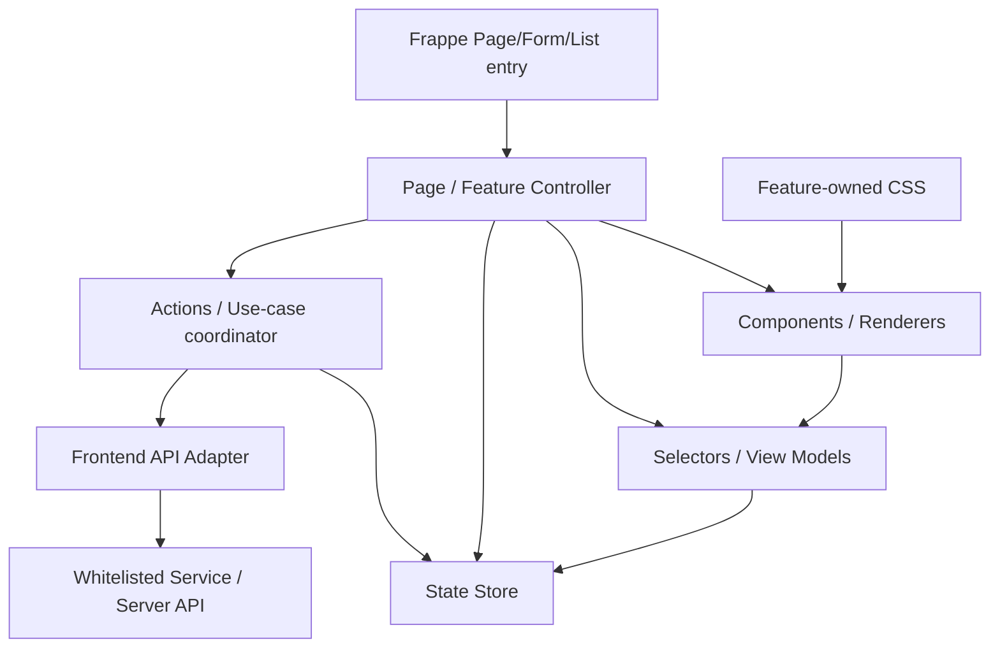

# 13 — Frontend Architecture

> **Status:** Canonical frontend specialization  
> **Audience:** Frontend developers, reviewers, QA, Coding AI  
> **Parent contract:** [02 — Architecture](02_ARCHITECTURE.md)  
> **Freeze:** [Architecture Freeze](ARCHITECTURE_FREEZE.md)

## 1. الهدف

واجهة Almdina ERP هي **Presentation / Interface Adapter** فوق Clean Architecture العامة للمشروع. هذا المستند لا ينشئ Architecture موازية، ولا يغيّر Business Rules أو Authorization أو Lifecycle؛ بل يحدد كيف يجب تنظيم JavaScript/CSS وصفحات Frappe بحيث تبقى الواجهة قابلة للصيانة والاختبار دون أن تتحول إلى مصدر ثانٍ لقواعد العمل.

الأهداف العملية:

- تعديل Feature في الواجهة دون إفساد Feature غير مرتبط.
- إبقاء Server/Application/Domain مصدر الحقيقة للقرارات التشغيلية والأمنية.
- جعل State وAsync lifecycle وDOM ownership واضحين.
- منع تراكم CSS أو Event handlers أو MutationObservers المتنافسة.
- الحفاظ على Arabic-first UI، RTL، responsiveness، keyboard/touch accessibility، وحالات loading/error/empty/dirty بشكل احترافي.
- تنفيذ Refactor تدريجي يحافظ على الشكل والسلوك أولًا، ثم تحسين UI/UX بشكل مستقل ومقصود.

لا يوجد قرار في هذه المرحلة لإدخال React أو Vue أو أي Framework واجهات جديد. Frappe/JavaScript الحالي يبقى التقنية الأساسية ما لم يُعتمد تغيير معماري منفصل عبر ADR.

## 2. اتجاه الاعتماد في الواجهة



القاعدة: **الـUI يتجه نحو Server boundaries؛ لا يعيد بناء Domain rules داخل المتصفح.**

## 3. الوحدات ومسؤولية كل واحدة

### Entry / Bootstrap

هو Composition Root للصفحة أو الـForm feature:

- يسجل `on_page_load` أو Frappe hooks المطلوبة.
- ينشئ Controller ويحقن dependencies اللازمة.
- يبدأ lifecycle فقط.
- يبقى صغيرًا ولا يحتوي Business Logic أو HTML ضخمًا أو CSS أو endpoint-specific workflows.

### Controller

يمتلك lifecycle وتنسيق الصفحة:

- initialization / refresh / dispose.
- الانتقال بين UI modes.
- ربط Actions بالRenderers.
- تنسيق loading/error/empty states.
- إدارة page/document identity عند العمليات غير المتزامنة.

لا يصبح Controller مستودعًا لكل HTML وAPI وCSS في الملف نفسه.

### Frontend API Adapter

يمتلك اتصال subsystem بالخادم:

- أسماء endpoints في مكان واحد.
- بناء request payloads الفنية فقط.
- توحيد `frappe.call` وتحويل response envelope إلى payload واضح.
- لا يقرأ أو يغيّر DOM.
- لا يقرر من يملك صلاحية Business action؛ الخادم هو authority.

### Store / State

يمتلك mutable client state لصفحة أو Feature:

- يوجد **مالك واحد** لكل state mutable.
- لا تُنسخ derived values إلى state إذا أمكن اشتقاقها.
- dirty state يستخدم baseline/working model أو آلية صريحة مكافئة.
- لا يستدعي API ولا يلمس DOM.
- globals تستخدم فقط للعقود العامة المقصودة والمثبتة معماريًا، وليست مخزن state افتراضيًا.

### Selectors / View Models

دوال خالصة قدر الإمكان:

- تحويل state/server payload إلى بيانات جاهزة للعرض.
- filtering/sorting/grouping/derived labels.
- لا API ولا DOM ولا side effects.
- يجب أن تكون قابلة للاختبار بـNode دون Frappe كامل عندما يكون ذلك عمليًا.

### Actions

تنسق intent المستخدم مع API وStore:

- تمنع duplicate submit/save عند الحاجة.
- تطبق latest-request-wins أو cancellation semantics عندما يمكن أن تصل الاستجابات بترتيب مختلف.
- تحدث Store بعد نجاح الخادم.
- تعرض failure state عبر Controller/UI contract.
- لا تنسخ قواعد lifecycle أو authorization من Server إلى JavaScript.

### Components / Renderers

تملك presentation والتفاعل المحلي فقط:

- HTML/view rendering.
- event callbacks المحلية.
- focus/accessibility attributes.
- لا تستدعي `frappe.call` مباشرة في target architecture.
- لا تستخدم Role names لتقرير Business permissions.
- لا تخزن state عام غير مملوك لها.

### Styles

- لكل Feature/Page مالك style واحد واضح.
- CSS غير البسيط يكون asset خارجيًا، وليس `style.textContent` داخل Controller، في target architecture.
- Shared CSS يقتصر على primitives مشتركة فعلًا؛ لا يملك selectors خاصة بFeature واحدة.
- لا يُنقل CSS لمجرد النقل إذا كان ذلك سيغيّر cascade/runtime behavior دون tests؛ extraction يجب أن يكون محافظًا على الشكل.

## 4. القواعد المعيارية المحمية

هذه المعرفات ثابتة وتستخدمها اختبارات Architecture. تغيير معناها Contract change مقصود، وليس تعديلًا عابرًا.

### `FE-ARCH-001` — Frontend is an outer layer
الواجهة Presentation Adapter؛ لا تعتمد Domain/Application على ملفات page/public JS/CSS.

### `FE-ARCH-002` — One owner for mutable state
كل mutable state له owner واحد. لا توجد نسخ متنافسة من نفس الحقيقة بين globals وDOM وcontroller state.

### `FE-ARCH-003` — One API boundary per subsystem
الـendpoint names و`frappe.call` الخاصة بالـsubsystem تتجمع خلف API adapter عند migration، ولا تنتشر داخل leaf renderers/components.

### `FE-ARCH-004` — Derived data belongs to selectors
Filtering/sorting/grouping/view-model derivation تكون pure selectors حيثما أمكن بدل تكرارها داخل render functions وevent handlers.

### `FE-ARCH-005` — Leaf UI has no business authority
Component/renderer لا يقرر lifecycle أو authorization ولا يستبدل قرار الخادم.

### `FE-ARCH-006` — Server authorization is authoritative
Capabilities/action booleans/server scope هي مصدر السلطة. إخفاء زر في المتصفح UX فقط وليس Security boundary. يمنع Role-name authorization مثل `frappe.user_roles` أو افتراض أن `System Manager` يملك صلاحيات المعمل.

### `FE-ARCH-007` — Async results must be current
أي request يمكن أن يصبح stale يحتاج request-id/latest-wins أو cancellation أو document/page token. لا يجوز لاستجابة قديمة أن تعيد رسم سجل/طلب/وضع لم يعد هو الحالي.

### `FE-ARCH-008` — Events, timers and observers have lifecycle ownership
Event handlers وtimers وMutationObservers تكون idempotent أو قابلة للتنظيف ومملوكة لسطح محدد. لا يُنشأ Observer ثانٍ لنفس surface كحل دائم لمنافسة Observer أول.

### `FE-ARCH-009` — One style owner per feature
لا يملك shared shell CSS خاصًا بFeature محلية بعد اكتمال migration. Inline style injection الموجود حاليًا يعد migration debt، لا pattern جديدًا.

### `FE-ARCH-010` — Arabic-first professional UX
النصوص القابلة للترجمة تمر عبر `__()`، والواجهات تدعم RTL/logical layout، keyboard/focus، touch targets، responsive behavior، reduced-motion عندما توجد حركة، وحالات loading/error/empty/disabled/dirty الواضحة.

### `FE-ARCH-011` — Respect bounded frontend subsystems
Door Drawing V3 يحتفظ ببنيته `domain/application/infrastructure/presentation`. لا تُفرض عليه بنية Frappe Page لمجرد توحيد الأسماء.

### `FE-ARCH-012` — Structural refactors are visually neutral first
فصل API/Store/Renderer/CSS لا يُخلط في نفس الخطوة مع redesign غير ضروري. أول migration يحافظ على behavior وUI قدر الإمكان؛ تحسين UI/UX يأتي بChange مستقل قابل للمراجعة.

### `FE-ARCH-013` — Pure frontend logic is directly testable
Store/selectors/actions الخالصة تحصل على Node/unit tests عند استخراجها، إضافة إلى source/ownership contracts والـintegration regressions الحالية.

### `FE-ARCH-014` — Runtime asset ownership/order is preserved
`almdina_erp/frontend_assets.py` يبقى مالك asset manifest. ترتيب DCO assets والـdual-load allowlist والعقود في `public/js/door_cutting_order/ARCHITECTURE.md` لا تتغير أثناء local extraction إلا بتغيير dependency مقصود واختبارات مناسبة.

### `FE-ARCH-015` — No framework rewrite by stealth
لا يتم إدخال frontend framework أو bundling/state platform جديد كجزء جانبي من cleanup. أي تغيير تقني واسع يحتاج سببًا معماريًا وADR منفصلًا.

## 5. Async وRace Conditions

كل Controller/Action يجب أن يسأل: هل يمكن للمستخدم تغيير الصفحة أو الـrecord أو filter أو mode قبل وصول الاستجابة؟ إذا نعم، فهناك stale-response risk.

الأنماط المقبولة:

- monotonically increasing `requestId` مع مقارنة قبل commit/render.
- document identity/generation token مثل `AlmdinaDocumentContext` في DCO.
- `AbortController` عندما تكون طبقة النقل قابلة للإلغاء.
- operation token لعمليات save/import/preview المتداخلة.

لا يكفي أن request “غالبًا سريع”. يجب حماية ownership عند وجود race محتمل.

## 6. Event / DOM lifecycle

- registration يجب أن يكون idempotent أو يقابله dispose واضح.
- delegated events تستخدم عندما يعاد بناء subtree كثيرًا.
- لا تستخدم `stopImmediatePropagation()` كحل معماري جديد إلا لحاجز compatibility مؤقت موثق ومختبر.
- MutationObserver يستخدم للضرورة، مع owner واحد لنفس surface وحدود mutation ضيقة.
- `setTimeout`/`requestAnimationFrame` المرتبطان بوثيقة يجب ألا يرسمَا وثيقة أصبحت قديمة.
- إعادة زيارة Frappe Page يجب أن تحترم unsaved/dirty state ولا تستبدله بتحميل تلقائي.

## 7. Authorization في الواجهة

Frontend يستهلك فقط القرارات المناسبة للعرض:

```text
Server capability/action/scope
        ↓
Frontend context / API payload
        ↓
Button visibility + enabled state + explanation
```

ممنوع أن يصبح المسار:

```text
Role name in browser
        ↓
Business permission decision
```

إذا كان endpoint محميًا، يبقى محميًا حتى لو استُدعي يدويًا دون UI. وإذا أُخفي زر، فهذا لا يمنح أي ضمان أمني وحده.

## 8. UI/UX quality contract

Professional UI لا يعني المزيد من animation أو cards؛ يعني واجهة متوقعة وواضحة ومناسبة لسياق المصنع.

لكل surface نراجع:

- **Hierarchy:** primary action واضح، secondary actions أقل بروزًا.
- **Feedback:** loading/save/processing/success/error states مرئية ولا تعتمد على التخمين.
- **Density:** desktop يستفيد من العرض، mobile يعيد ترتيب المحتوى بدل تصغيره فقط.
- **Input safety:** لا يعاد render أثناء الكتابة بطريقة تفقد focus أو تحذف أحرفًا.
- **Navigation:** reopening/revisit يعرض record الصحيح ولا state من record سابق.
- **Accessibility:** focus order، keyboard actions، labels/ARIA عند الحاجة، touch targets مناسبة.
- **Localization:** Arabic-first وRTL، مع عدم كسر النصوص الطويلة أو البريد/الأرقام LTR داخل RTL.
- **Motion:** الحركة وظيفية وقابلة للتقليل عند `prefers-reduced-motion` عندما تكون موجودة.

## 9. Subsystems الموجودة وحدودها

### Door Cutting Order

الـownership الحالي تحت:

`almdina_erp/public/js/door_cutting_order/`

هو Contract قائم. راجع `public/js/door_cutting_order/ARCHITECTURE.md`. F6 يستهدف hotspots داخل owners الحالية ولا يعيد بناء شجرة DCO ولا يخلط path moves مع business changes.

### Door Drawing V3

هو bounded frontend subsystem بطبقات خاصة به. Domain geometry لا يعتمد DOM/Frappe، والـpresentation/infrastructure في الخارج. Generic Frappe-page refactor لا يطبق عليه.

### Permission Context / shared infrastructure

Cross-app modules مثل `permission_context.js` وshared helpers قد تكون أكبر من ملف عادي لكنها لا تُقسّم لمجرد الحجم. معيار التقسيم هو **cohesion + ownership + testability** لا عدد الأسطر.

### Frappe admin pages

Factory Permissions / Workforce / Production Settings هي أول migration family لأن حدودها واضحة ويمكن فصل state/API/render/styles تدريجيًا دون تغيير Business contracts.

### Shop Floor

يحتفظ server-side scope والـrequest freshness الحاليين. الهدف لاحقًا فصل API/state/selectors/Kanban/list/actions وتوحيد style ownership، لا تغيير من يرى ماذا أثناء refactor.

## 10. Migration sequence

1. **F2 — Architecture Contract:** هذا المستند + CI contract، بدون runtime change.
2. **F3 — Minimal Shared Foundation:** helpers صغيرة فقط للتكرار المثبت (API/request/lifecycle/loading/style loading)، بلا mini-framework.
3. **F4 — Admin Frontend Family:** Permissions ثم Workforce ثم Production Settings؛ extraction أولًا ثم UI improvements المستقلة.
4. **F5 — Shop Floor:** state/API/selectors/render ownership مع الحفاظ على server scope وKanban/list behavior.
5. **F6 — DCO Targeted Cleanup:** hotspots فقط داخل feature owners الحالية؛ patches تزال فقط بعد توحيد owner واختبارات regression.
6. **F7 — Frontend Quality Gate:** يرفع القواعد التي أثبتتها migrations إلى CI أشد صرامة.

## 11. Anti-patterns

لا نضيف كودًا جديدًا على شكل:

```text
one page file
├── huge CSS string
├── endpoint names
├── mutable state
├── authorization guesses
├── rendering
├── business calculations
├── observers/timers
└── all event handlers
```

ولا نعالج التعقيد بواسطة:

- global mutable state بلا owner.
- duplicated server formulas في JS.
- Role-name authorization.
- CSS selector عالمي لإصلاح Feature محلية.
- Observer جديد لإبطال Observer سابق كحل دائم.
- reload كامل كبديل لإدارة state صحيحة.
- silent catch يخفي failure ويترك UI قديمة.
- refactor + redesign + business change في Commit واحد.

## 12. Definition of Done لأي Frontend migration

يعتبر subsystem migrated عندما:

1. ownership لكل state/API/render/style/event واضح.
2. leaf presentation لا يملك server business authority.
3. stale async response لا يستطيع رسم context قديم.
4. events/observers/timers لا تتضاعف مع refresh/revisit.
5. CSS له owner واضح ولا يتسرب من shared layer إلى feature محلية.
6. behavior/security/lifecycle contracts بقيت دون تغيير ما لم يكن التغيير مطلوبًا صراحةً.
7. structural extraction له tests، وpure logic اختُبر مباشرة حيثما أمكن.
8. Arabic/RTL/responsive/keyboard/touch states لم تتراجع.
9. asset ownership/order والعقود المجمدة بقيت سليمة.
10. Static/Security/Frappe v16 gates المناسبة خضراء قبل الدمج.

## 13. قاعدة المراجعة

عند مراجعة أي Frontend PR، لا تسأل فقط “هل يعمل؟”. اسأل أيضًا:

- من يملك هذه الحقيقة؟
- هل هذا القرار Presentation أم Business rule؟
- هل يمكن لاستجابة قديمة أن تصل بعد context جديد؟
- من ينظف هذا event/observer/timer؟
- لماذا هذا CSS هنا، ومن يملكه؟
- هل يمكن اختبار المنطق دون DOM/Frappe؟
- هل فصلنا structural change عن visual/business change؟

إذا لم توجد إجابة واضحة، فالمشكلة Architecture حتى لو بدا الـUI صحيحًا اليوم.
